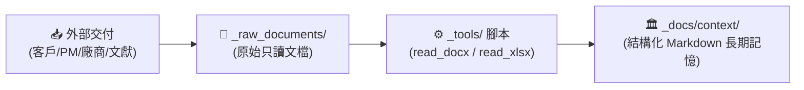

# 📥 原始規格與文檔進駐池 (_raw_documents)

> **核心定位**：存放專案接收到的各類外部非結構化原始文檔（Word `.docx`、Excel `.xlsx`、PDF、PPTX、XML 範例、圖表）。  
> 無論是軟體工程需求、商業企劃還是學術研究素材，此目錄作為專案知識庫的「**原始輸入源頭 (Source of Truth)**」。

---

## 🔄 核心生命週期流轉機制 (Lifecycle Workflow)

所有進入此目錄的文檔，皆遵循以下三段式生命週期：

1. **原始存放 (Raw Ingestion)**：
   - 保留原貌、唯讀對待。**禁止直接覆寫二進位檔案**，以防歷史依據遺失。
   - 建議按交付時間或批次建立子目錄（例如：`202609客製功能/`、`連線資訊/`、`參考文獻/`）。
2. **工具萃取 (Extraction)**：
   - 透過根目錄工具庫 `_tools/read_docx.py` 或 `_tools/read_xlsx.py`，秒級提取文字或 Markdown 表格。
3. **沉澱為長期記憶 (Structured Knowledge)**：
   - AI 與開發者將提取出的核心資訊、業務邏輯與架構決策，提煉整理為 `_docs/context/01_規劃與計畫/Plan_*.md` 或 `02_技術研究與分析/Research_*.md`。

---

## 🛡️ 資安與版控防護規範

為防止機密憑證與肥大檔案污染 Git 倉庫，本目錄已在專案根目錄 `.gitignore` 預設過濾：
- 🚫 **網路與金鑰憑證**：`*.ovpn`, `*.key`, `*.pem`, `*.p12`, `*.crt`, `*.id_rsa`
- 🚫 **巨型壓縮檔**：`*.zip`, `*.tar.gz`, `*.iso`, `*.7z`（超過 50MB 之檔案請放外部 NAS）
- ⚠️ **機密提醒**：若文件包含客戶身分證、財務機密或生產環境真實密碼，請於萃取為 Markdown 時完成去敏處理。
