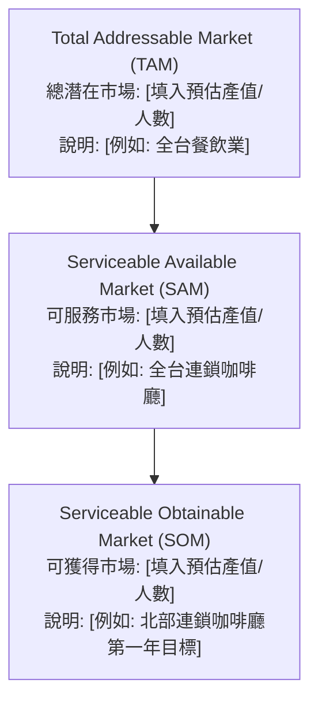

# 🚀 市場進入策略 (Go-To-Market Strategy)

> **建立日期**：{{DATE}}
> **負責人**：{{AUTHOR}}
> **專案代號/產品名稱**：{{PROJECT_KEY}}
> **關聯計畫**：[[01_規劃與計畫]]

---

## 📈 1. 市場規模與漏斗 (Market Sizing Funnel)

> 💡 **評估基準**：[說明數據來源或推估邏輯，如：政府統計數據、產業報告]

---

## 🎯 2. STP 分析 (Segmentation, Targeting, Positioning)

### 2.1 市場細分 (Segmentation) & 目標客群 (Targeting)
| 區隔變數 | 目標市場特徵 (Target Audience Profiles) | 核心痛點 (Pain Points) |
| :--- | :--- | :--- |
| **人口統計** | [例如：25-35 歲，都會區白領] | [例如：生活節奏快，缺乏運動時間] |
| **行為特徵** | [例如：每週使用外送 App 超過 3 次] | [例如：在意餐點健康度但不想花時間準備] |
| **心理特徵** | [例如：追求高效率、重視生活品質] | [例如：願意為省時與便利支付溢價] |

### 2.2 品牌定位 (Positioning)
- **定位聲明 (Positioning Statement)**：對於 `[目標客群]`，我們提供 `[產品/服務]`，能解決 `[痛點]`，因為我們具備 `[獨特優勢]`，有別於 `[主要競爭者]`。

---

## 🛠️ 3. 行銷組合 4P (Marketing Mix)

| 構面 | 策略規劃 | 執行細節與備註 |
| :--- | :--- | :--- |
| **Product (產品)** | [核心產品線與包裝組合] | [例如：主打 MVP 版本，包含核心三功能] |
| **Price (價格)** | [定價策略，如：撇脂、滲透、價值導向] | [例如：早鳥優惠 $X，正式定價 $Y] |
| **Place (通路)** | [銷售與經銷管道] | [例如：自有官網 (80%) + 合作經銷商 (20%)] |
| **Promotion (促銷)** | [推廣活動與公關策略] | [例如：上市首月 KOC 開箱 + 數位廣告投放] |

---

## 📅 4. 關鍵里程碑與時程表 (Timeline & Milestones)

| 階段 | 預定日期 | 關鍵任務 (Key Tasks) | 交付物 (Deliverables) |
| :--- | :--- | :--- | :--- |
| **T-30 預熱期** | [日期] | 建立 Landing Page、開始收集名單 | 500 筆潛在名單 |
| **T-Day 上市日** | [日期] | 正式發表會、啟動公關稿與數位廣告 | 媒體曝光至少 10 篇 |
| **T+30 放大期** | [日期] | 檢視初期成效、優化廣告 CPA、推動轉介紹 | 達成初步銷售目標 |

---

## 💰 5. 預算分配與預期效益 (Budget & ROI)

- **總預算**：[填入總金額]
- **預算分配**：
  - 數位廣告：XX%
  - 網紅/公關：XX%
  - 實體活動：XX%
- **預期效益 (KPIs)**：
  - 獲客成本 (CAC) 目標：< $X
  - 首月業績目標：$Y
