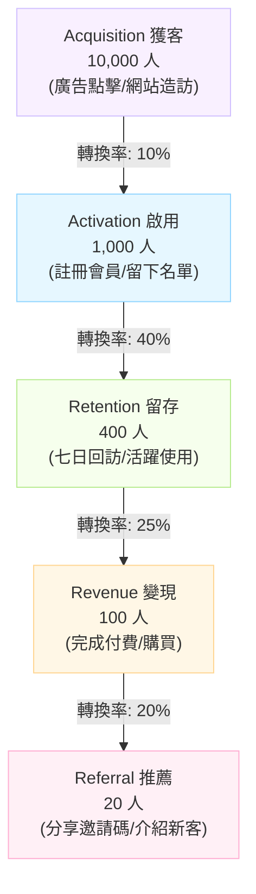

# 🌪️ 行銷漏斗數據分析與活動復盤 (Marketing Funnel)

> **活動/分析期間**：{{DATE}}
> **活動名稱**：{{PROJECT_KEY}}
> **負責人**：{{AUTHOR}}
> **關聯計畫**：[[03_工作紀錄與驗證]]

---

## 🌪️ 1. AARRR 漏斗成效可視化 (Funnel Visualization)

> 💡 **漏斗斷層診斷**：[指出漏斗中轉換率低於預期的環節，例如：獲客到啟用的轉換率僅 10%，低於業界平均 15%。]

---

## 📈 2. 獲客通路 ROI 數據 (Channel Performance)

| 行銷通路 (Channel) | 投入預算 (Cost) | 帶來流量 (Traffic) | 獲得名單 (Leads) | 獲得客戶 (Customers) | 獲客成本 (CAC) | 投資報酬率 (ROI) |
| :--- | :--- | :--- | :--- | :--- | :--- | :--- |
| **Facebook 廣告** | $50,000 | 5,000 | 250 | 25 | $2,000 | 120% |
| **Google 關鍵字** | $30,000 | 2,000 | 150 | 30 | $1,000 | 250% |
| **KOL 合作** | $40,000 | 8,000 | 400 | 15 | $2,666 | 80% |
| **總計 / 平均** | **$120,000** | **15,000** | **800** | **70** | **$1,714** | **145%** |

- **表現最佳通路**：[例如：Google 關鍵字，CAC 最低且 ROI 最高。]
- **需優化/暫停通路**：[例如：KOL 合作流量雖大，但轉換極差，需檢討網紅受眾是否精準。]

---

## 📝 3. 活動綜合復盤 (Campaign Post-Mortem)

### 3.1 亮點與做得好的地方 (What Went Well)
- [例如：素材 A 的 CTR 高達 5%，遠超平均。]
- [例如：活動落地頁載入速度優化後，跳出率降低了 20%。]

### 3.2 痛點與可改善之處 (What Didn't Go Well)
- [例如：結帳流程過於繁瑣，導致購物車放棄率高達 60%。]
- [例如：客服人力預估不足，活動首日客訴回應時間超過 4 小時。]

---

## 🚀 4. 下一步行動計畫 (Action Items)

| 改善項目 | 負責人 | 預計完成日 | 具體做法 |
| :--- | :--- | :--- | :--- |
| **優化結帳流程** | [PM 姓名] | [日期] | 引入一鍵結帳功能，減少表單欄位 |
| **調整廣告預算** | [行銷姓名] | [日期] | 削減 KOL 預算 50%，轉移至 Google 關鍵字 |
| **設計召回信件** | [CRM 姓名] | [日期] | 針對購物車放棄用戶發送 9 折催促信 |
