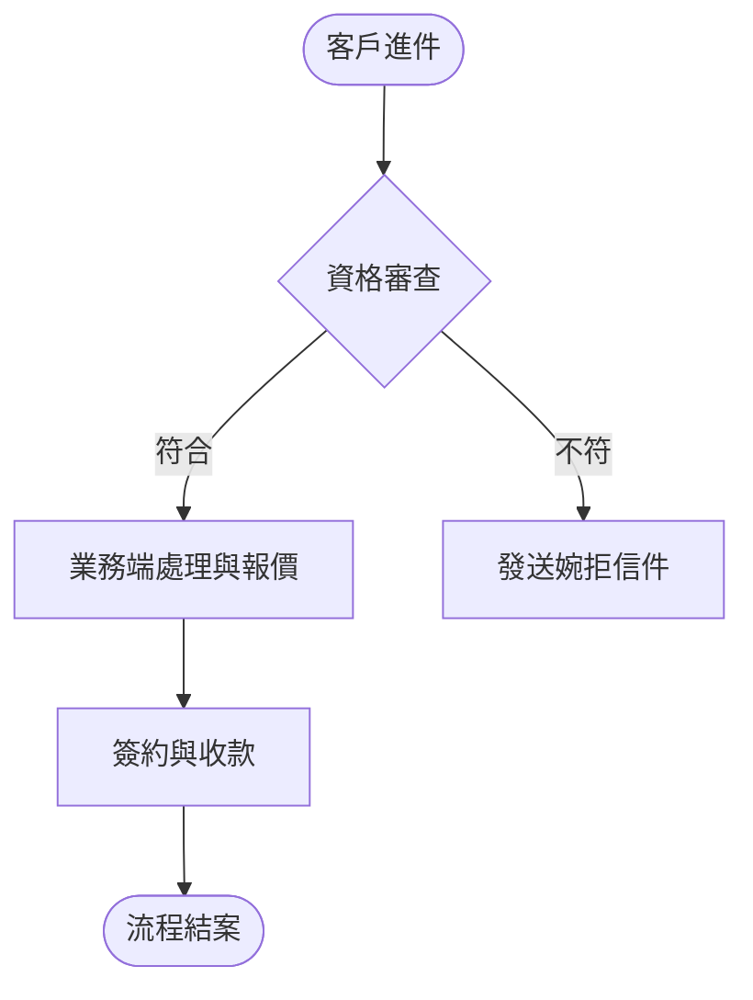

# 📋 Plan_【商業專案/活動名稱】實施計畫

> **建立日期**：{{DATE}}
> **專案類型**：業務拓展 / 營運優化 / 行銷活動 / 組織變革
> **狀態**：規劃中 / 審查中 / 已核准 / 執行中 / 已結案
> **負責人**：{{AUTHOR}}

---

## 🎯 1. 背景與核心目標 (Background & Goals)

### 1.1 背景與機會陳述 (Opportunity Statement)
[描述為什麼要發起這個商業專案？解決了什麼業務痛點、或是捕捉了什麼市場機會？]

### 1.2 專案特許目標 (Project Charter & Goals)
- [ ] 商業目標一：[例如：Q3 提升 B2B 企業客戶留存率至 90%]
- [ ] 營運目標二：[例如：降低客服處理退貨的平均工時 20%]

### 1.3 專案邊界 (Out of Scope)
- 本次專案不包含：[明確排除的事項，避免範疇潛變 (Scope Creep)]

---

## 🔄 2. 業務流程與權責設計 (Business Process & RACI)

### 2.1 流程再造設計 (As-Is ➔ To-Be Process)

### 2.2 RACI 跨部門權責矩陣
| 任務 / 流程環節 | 負責執行 (Responsible) | 當責批准 (Accountable) | 諮詢顧問 (Consulted) | 資訊知會 (Informed) |
| :--- | :--- | :--- | :--- | :--- |
| **合約條款擬定** | 法務部 | 總經理 | 業務部 | 財務部 |
| **行銷素材製作** | 設計部 | 行銷總監 | 產品部 | 全體員工 |
| **客訴處理標準制定** | 客服部 | 營運長 | 業務部 | 行銷部 |

---

## 💰 3. 資源與預算配置 (Resource & Budget Allocation)

- **預算總額**：[填寫預算數字]
- **預算拆解**：
  - 外部採購 / 供應商：[金額與說明]
  - 行銷推廣費用：[金額與說明]
  - 內部作業成本：[金額與說明]
- **人力資源配置 (HR & Vendors)**：
  - 內部人力：[需要哪些部門支援多少工時]
  - 外部資源：[是否有外包廠商或顧問介入]

---

## 🗓️ 4. 實施階段與任務推動 (Implementation Phases)

### Phase 1：調研與前置準備 (Investigation & Prep)
- [ ] 競爭者分析與市場調研報告完成
- [ ] 供應商報價比較與合約簽署

### Phase 2：小規模試點 (Pilot Run)
- [ ] 針對特定 VIP 客戶進行封測或試營運
- [ ] 收集初期反饋並微調流程

### Phase 3：全面上線推廣 (Full Rollout)
- [ ] 跨部門教育訓練與 SOP 發布
- [ ] 正式對外宣佈/行銷活動上線

### Phase 4：效益檢視與復盤 (Benefit Review)
- [ ] 產出 `Walkthrough_【商業專案名稱】.md`
- [ ] 執行專案復盤會議 (Post-Mortem)

---

## ⚠️ 5. 風險評估與應對 (Risk Assessment)

| 風險項目 | 發生機率 (高/中/低) | 影響程度 (高/中/低) | 預防與備援策略 (Mitigation Plan) |
| :--- | :---: | :---: | :--- |
| **營運中斷 (Operational Disruption)** | 低 | 高 | 安排試點期，建立降級或人工處理的 SOP |
| **法規合規性 (Regulatory Compliance)** | 中 | 高 | 提前請法務部門審閱合約與隱私條款 |
| **組織變革阻力 (Organizational Resistance)** | 高 | 中 | 舉辦部門說明會，並將新指標納入績效考核 |
