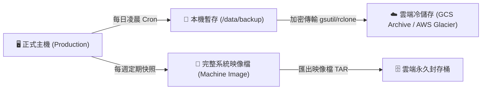

# 💾 備份驗證、快照封存與災難復原演練計畫 (Disaster Recovery & Backup)

> **建立日期**：{{CURRENT_DATE}}  
> **專案代號**：{{PROJECT_KEY}}  
> **負責人**：{{AUTHOR}}  
> 
> 💡 **關聯文檔**：
> - [[_docs/_templates/infra/tpl_Host_Maintenance_SOP|🛠️ 主機日常維運 SOP]]
> - [[_docs/_templates/tpl_Server_Environment|🖥️ 伺服器環境配置]]

---

## 🎯 1. 災難復原目標 (RPO & RTO)

| 指標 | 定義 | 本專案目標值 | 達成機制 |
| :--- | :--- | :--- | :--- |
| **RPO (復原點目標)** | 災難發生時允許丟失的最多數據時間 | **< 24 小時** (資料庫每日備份)<br>重要交易 **< 15 分鐘** (WAL/Binlog) | 每日凌晨自動全量備份 + 即時二進位日誌複製 |
| **RTO (復原時間目標)** | 系統從中斷到完全恢復服務所需時間 | **< 2 小時** (冷備份還原)<br>**< 15 分鐘** (快照映像檔還原) | 封存映像檔 (Machine Image) + 自動化啟動腳本 |

---

## 📦 2. 備份策略矩陣 (3-2-1 備份原則)



| 備份對象 | 備份方式 | 執行週期 | 保存期限 | 存放地點 | 成本優化方案 |
| :--- | :--- | :--- | :--- | :--- | :--- |
| **MySQL 資料庫** | `mysqldump` / XtraBackup | 每日 03:00 | 30 天 | GCS Standard ➔ 7 天轉 Nearline | 生命週期規則自動降級 |
| **使用者上傳檔案** | `rclone` 增量同步 | 每日 04:00 | 永久 | GCS Coldline 儲存區 | 啟用版本控制與去重 |
| **整機系統環境** | GCP Machine Image / AMI | 每月 / 重大改動前 | 90 天 | 轉存至 GCS Archive (封存) 區 | 映像檔轉存 Archive，省下 80% 費用 |

---

## 🛠️ 3. GCP 機器映像檔轉存 Archive 實戰操作指令

### 步驟 1：建立目前主機之完整 Machine Image
```bash
gcloud compute machine-images create img-backup-$(date +%Y%m%d) \
    --source-instance=<instance-name> \
    --source-instance-zone=asia-east1-b
```

### 步驟 2：將映像檔匯出為 GCS 封存檔 (節省高額 Disk Snapshot 費用)
```bash
# 匯出為 tar.gz 至 Cloud Storage Archive 桶
gcloud compute images export \
    --image=img-backup-$(date +%Y%m%d) \
    --destination-uri=gs://<your-archive-bucket>/backups/img-backup-$(date +%Y%m%d).tar.gz
```

### 步驟 3：清理原映像檔保留封存檔
```bash
gcloud compute images delete img-backup-$(date +%Y%m%d) --quiet
```

---

## 🧪 4. 災難復原演練流程 (Quarterly Drill SOP)

### 演練場景：正式機硬碟損毀 / 雲端區域斷線
1. **模擬觸發**：在非生產環境啟動全新乾淨 VM。
2. **提取備份**：
   ```bash
   # 從 GCS 下載最新 SQL 備份
   gsutil cp gs://<your-backup-bucket>/mysql/latest.sql.gz /tmp/
   gzip -d /tmp/latest.sql.gz
   ```
3. **還原驗證**：
   ```bash
   # 注入至測試資料庫
   mysql -u root -p test_restore < /tmp/latest.sql
   ```
4. **完整性核對**：
   - 抽查關鍵資料表記錄筆數（`SELECT COUNT(*) FROM users;`、`manufacture_order`）。
   - 隨機核對最後 10 筆業務交易資料的 Timestamp。
5. **演練記錄歸檔**：將演練耗時、遇到的報錯與修正建議填寫於下方驗證報告。

---

## 📝 5. 最近三次復原演練記錄

| 演練日期 | 演練負責人 | 備份來源檔案 | 實際恢復耗時 (RTO) | 資料完整度 | 改善行動追蹤 |
| :--- | :--- | :--- | :--- | :--- | :--- |
| {{CURRENT_DATE}} | {{AUTHOR}} | `initial_backup_verification` | 25 分鐘 | 100% 通過 | 初次建立基線 |
