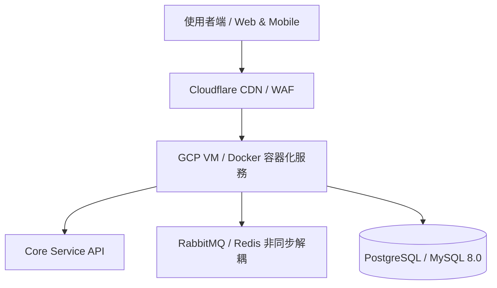

# 🏆 專案成果與 Portfolio 展示簡報 (Project Showcase & Portfolio)

> **專案名稱**：{{PROJECT_NAME}}
> **結案/發布日期**：{{DATE}}
> **主導工程師**：{{AUTHOR}}
> **專案定位**：[一句話描述專案的核心商業與技術價值]

---

## 🌟 1. 專案背景與解決痛點 (Problem & Mission)

- **痛點現狀**：[在導入本系統前，面臨的高昂授權費、資料混亂、高併發當機或人工繁瑣流程]
- **核心使命**：[透過現代化技術棧與 AI 工作流，實現何種突破？]

---

## 🏗️ 2. 系統架構與技術棧亮點 (Architecture & Tech Stack)

### 核心技術棧：
- **後端 / 運算**：[例如：Python 3.12, PHP 8.2, Docker, PostgreSQL 16]
- **前端 / 互動**：[例如：Vue 3, OWL, HTML5/CSS3 Glassmorphic UI]
- **雲端 / DevOps**：[例如：GCP VM, Nginx Proxy, Cloudflare, SSH Tunneling]

---

## 🚀 3. 三大技術突破與實戰亮點 (Key Achievements)

1. **[亮點一：例如跨版本無痛遷移與資料 0 元對齊]**：
   - 撰寫跨庫 ETL 轉置腳本，無痛遷移數十萬筆複雜資料，新舊系統精算比對差異為 0。
2. **[亮點二：例如高併發非同步佇列與原子 Upsert]**：
   - 徹底解決高頻資料同步時的 Race Condition 與資料庫死鎖，保障系統 100% 穩定。
3. **[亮點三：例如極致成本防禦與架構解耦]**：
   - 移除昂貴的商業版授權綁定，改用開源社群方案，公司每年授權成本降為 $0 元。

---

## ⚡ 4. AI 輔助開發提效量化 (AI-Powered Efficiency)

| 指標面向 | 傳統手動開發 | AI 輔助工作流 (Antigravity/Claude) | 提效倍率 |
| :--- | :---: | :---: | :---: |
| **需求到架構設計 (Plan)** | 3~5 天 | 3~4 小時 (結構化對齊) | **~5x 🚀** |
| **API 開發與單元測試** | 2 週 | 2~3 天 (TDD 測試先行) | **~4x 🚀** |
| **版本遷移與代碼重構** | 1 個月 | 1 週 (AI 輔助 ETL 轉置) | **~4x 🚀** |

---

## 📸 5. 系統畫面與成果展示

> ``
