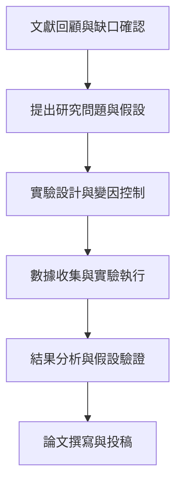

# 📝 Research_Proposal_【研究主題】研究計畫與問題陳述

> **建立日期**：{{DATE}}
> **對應領域**：01_規劃與計畫
> **研究計畫編號**：{{PROJECT_KEY}}
> **負責研究員**：{{AUTHOR}}
> **狀態**：構思中 / 審查中 / 已核准 / 執行中 / 已結案

---

## 🎯 1. 研究動機與問題陳述 (Research Motivation & Problem Statement)

### 1.1 研究背景與動機
[請描述本研究欲探討之背景與引發動機，此研究欲解決什麼實際或理論上的痛點？]

### 1.2 核心研究問題 (Research Questions)
- **RQ1**: [填寫第一研究問題，例如：在某種條件下，A 對 B 的影響為何？]
- **RQ2**: [填寫第二研究問題]

---

## 🔍 2. 文獻缺口與假設定義 (Literature Gap & Hypotheses)

### 2.1 文獻缺口 (Literature Gap)
[基於現有研究，指出目前的不足之處。例如：過往研究多集中於定性分析，缺乏大規模定量驗證。請參照 [[Literature_Review]]。]

### 2.2 研究假設 (Research Hypotheses)
- **H1**: [對應 RQ1 的假設，例如：A 的增加會導致 B 的顯著上升]
- **H2**: [對應 RQ2 的假設，例如：C 在 A 與 B 之間具有中介效應]

---

## 🛠️ 3. 研究方法與架構 (Methodology & Framework)

### 3.1 研究流程圖 (Research Pipeline)

### 3.2 研究方法 (Research Methodology)
| 階段 | 方法論 (定性/定量/混合) | 資料來源 / 樣本 | 分析工具 / 統計模型 |
| :--- | :--- | :--- | :--- |
| **資料收集** | 定量 (Quantitative) | 公開數據集 / 問卷抽樣 | Python / SPSS |
| **資料分析** | 混合 (Mixed) | 實驗日誌與測量數據 | ANOVA / 迴歸分析 |

---

## 🚀 4. 預期貢獻與創新性 (Expected Contributions & Innovation)

- **學術貢獻 (Theoretical)**：[本研究將如何擴展或修正現有理論框架？]
- **實務貢獻 (Practical)**：[本研究的結果對產業界或社會有何具體應用價值？]
- **創新點 (Novelty)**：[方法論創新、新數據集，或跨領域視角]

---

## 🗓️ 5. 研究時程規劃 (Timeline & Gantt)

| 階段任務 | 預計開始 | 預計完成 | 產出目標 |
| :--- | :--- | :--- | :--- |
| 文獻探討 | `YYYY-MM-DD` | `YYYY-MM-DD` | 產出 [[Literature_Review]] |
| 實驗執行 | `YYYY-MM-DD` | `YYYY-MM-DD` | 產出多份 [[Experiment_Log]] |
| 數據分析 | `YYYY-MM-DD` | `YYYY-MM-DD` | 產出 [[Research_Findings]] |
| 論文定稿 | `YYYY-MM-DD` | `YYYY-MM-DD` | 產出 [[Paper_Submission_Checklist]] |

> ⚠️ **風險控管**：[若實驗數據無法順利取得，備案為何？]
