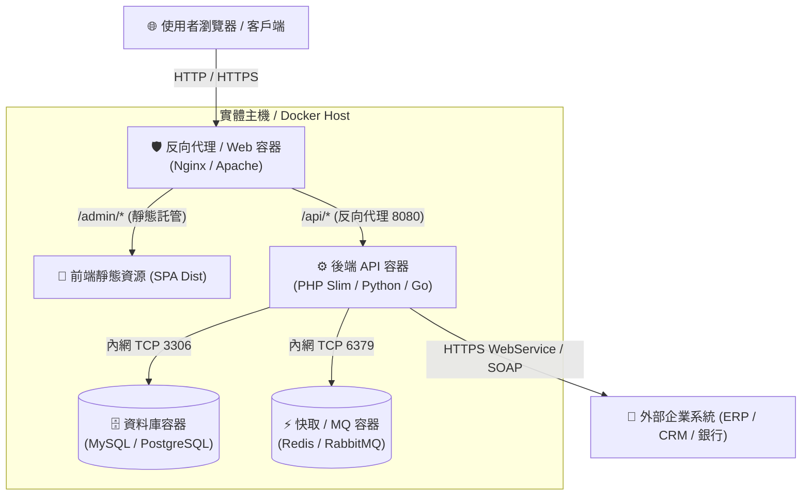

# 🐳 主機容器運行環境與部署架構深度解析

> **建立日期**：{{CURRENT_DATE}}  
> **專案代號**：{{PROJECT_KEY}}  
> **負責人**：{{AUTHOR}}  
> 
> 💡 **關聯文檔**：
> - [[_docs/_templates/tpl_Server_Environment|🖥️ 伺服器環境與連線資訊]]
> - [[_docs/context/04_維運與部署/上線與部署檢驗清單|📋 上線與部署檢驗清單]]

---

## 🌐 1. 網絡流量拓撲與架構圖



---

## 📦 2. 核心容器規格與 Port 映射清單

| 容器名稱 (Container) | 基礎映像 (Image) | 主機連接埠 : 容器連接埠 | 磁碟掛載 (Bind Mounts) | 重啟策略 |
| :--- | :--- | :--- | :--- | :--- |
| `app-proxy` | `nginx:alpine` | `80:80`, `443:443` | `./nginx/conf.d:/etc/nginx/conf.d`<br>`/var/www/html:/usr/share/nginx/html` | `always` |
| `app-backend` | `php:8.2-fpm` | `9000:9000` | `./backend:/var/www/app`<br>`./logs:/var/log/app` | `unless-stopped` |
| `app-database` | `mysql:8.0` | `127.0.0.1:3306:3306` | `/data/mysql:/var/lib/mysql` | `always` |
| `app-redis` | `redis:7-alpine` | `127.0.0.1:6379:6379` | `/data/redis:/data` | `always` |

---

## 🔀 3. 前後端共存機制與路由轉發原則

在單一網域/IP 下同時託管前後端服務時，反向代理核心轉發規則如下：

```nginx
# Nginx 路由重寫範例
server {
    listen 80;
    server_name localhost;

    # 1. 前端 SPA 應用（處理 Vue/React History 路由）
    location /admin {
        alias /usr/share/nginx/html/admin;
        try_files $uri $uri/ /admin/index.html;
    }

    # 2. 後端 REST API 請求轉發
    location /api {
        proxy_pass http://app-backend:8080;
        proxy_set_header Host $host;
        proxy_set_header X-Real-IP $remote_addr;
        proxy_set_header X-Forwarded-For $proxy_add_x_forwarded_for;
    }
}
```

---

## 💾 4. 磁碟目錄掛載與持久化策略

*   **日誌目錄**：主機 `/data/logs/{{PROJECT_KEY}}/` ➔ 容器 `/var/log/app/`（保留 30 天，啟用 logrotate）。
*   **使用者上傳檔案**：主機 `/data/uploads/` ➔ 容器 `/var/www/uploads/`（獨立磁碟分區，禁止執行二進位腳本）。
*   **資料庫數據庫**：主機 `/data/db_data/` ➔ 容器 `/var/lib/mysql/`（每日凌晨排程冷備份）。

---

## 🛠️ 5. 常用容器維運指令速查

### 查看容器運行狀態與資源占用
```bash
docker compose ps
docker stats --no-stream
```

### 查看應用服務日誌
```bash
docker compose logs -f --tail=100 app-backend
```

### 進入容器內部終端機排查
```bash
docker exec -it app-backend bash
```

### 重啟單一服務容器並刷新快取
```bash
docker restart app-backend
# 或透過工具範本執行
python _tools/probe_health.py http://localhost/api/health
```
