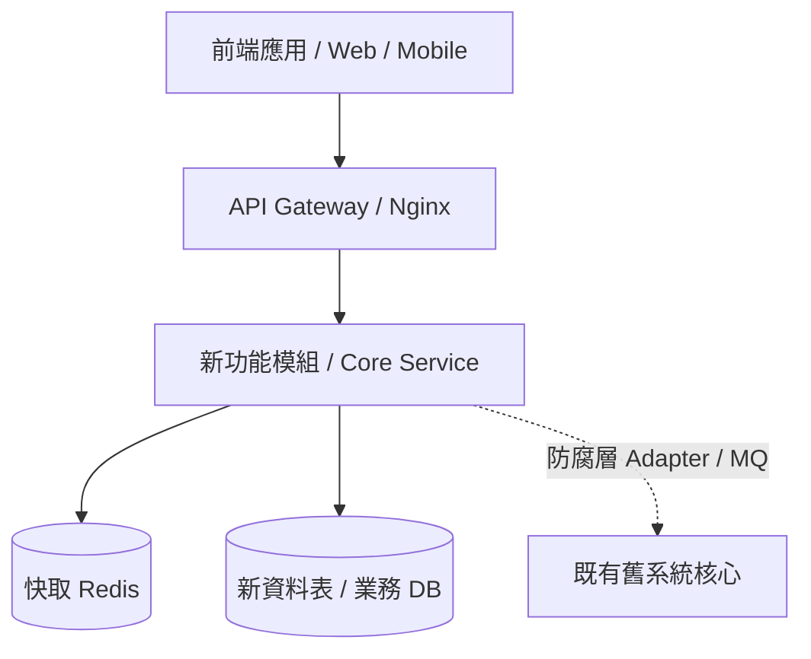

# Plan_【功能/模組名稱】實施計畫

> **建立日期**：{{DATE}}
> **專案模式**：GreenField (全新開發) / LegacyModule (舊系統擴充)
> **狀態**：規劃中 / 審查中 / 已核准 / 執行中 / 已結案
> **負責人**：{{AUTHOR}}

---

## 🎯 1. 背景與核心目標 (Background & Goals)

### 1.1 背景說明
[描述為什麼要做這個功能/重構？解決了什麼業務痛點或技術債？]

### 1.2 核心目標 (Goals)
- [ ] 目標一：...
- [ ] 目標二：...

### 1.3 非本期目標 (Non-Goals / Out of Scope)
- 不包含：...

---

## 🏗️ 2. 系統架構與整合邊界設計 (Architecture & Boundaries)

### 2.1 系統架構圖 (System Architecture)

### 2.2 系統整合邊界 (Integration Boundary) ※舊系統新模組必填
| 整合對象 | 整合方式 (API / DB / MQ / Hook) | 資料流向 | 介面定義 / 資料結構 |
| :--- | :--- | :--- | :--- |
| **舊系統會員表** | 唯讀查詢 / View | 舊 ➔ 新 | `users.id`, `users.role` |
| **訂單同步** | RabbitMQ 事件佇列 | 新 ➔ 舊 | `OrderCreatedEvent` payload |
| **舊系統 Webhook** | HTTP POST 攔截點 | 雙向 | `POST /api/v1/legacy-hook` |

### 2.3 舊系統影響範圍評估 (Blast Radius) 與防腐層設計
- **潛在破壞風險 (Blast Radius)**：[分析此功能是否可能影響舊有既有模組]
- **防腐層 (Anti-Corruption Layer) 設計**：[如何封裝 Adapter/Interface，確保新舊系統解耦]
- **回退方案 (Rollback Plan)**：[若新功能上線異常，如何快速降級或切回舊邏輯]

---

## 🗄️ 3. 資料庫變更設計 (Database Changes)

- **新增/修改資料表**：
- **索引與約束 (Indexes & Unique Constraints)**：
- **Migration 策略**（是否向後相容？是否需要跨庫資料轉置？）：

---

## 🗓️ 4. 實施階段與任務拆解 (Phases & Multi-Repo Tasks)

### Phase 1：基礎架構與資料層 (Backend / DB Repo)
- [ ] 【Backend】建立資料庫 Migration 腳本
- [ ] 【Backend】實作防腐層 Adapter 與核心 Repository

### Phase 2：業務邏輯與 API 介面 (Backend Repo)
- [ ] 【Backend】核心業務 Service 與 Controller 開發
- [ ] 【Backend】單元測試與 API 測試綠燈

### Phase 3：前端 UI 與互動串接 (Frontend / Admin Repo)
- [ ] 【Frontend】開發使用者操作頁面與表單校驗
- [ ] 【Frontend】串接後端 API 與錯誤處理 (Toast/Modal)

### Phase 4：整合驗證、UAT 與上線準備
- [ ] 跨端聯調測試 (E2E)
- [ ] 零回歸驗收 (Zero Regression Test)
- [ ] 產出 `Walkthrough_【功能名稱】.md`

---

## ⚠️ 5. 風險評估與防禦措施

| 風險項目 | 影響程度 (高/中/低) | 預防與備援措施 |
| :--- | :---: | :--- |
| 舊系統資料格式不一致 | 高 | 在防腐層加入嚴格資料校驗與 Schema Mapping |
| 高併發導致資料庫死鎖 | 中 | 實作原子 Upsert 或引入非同步佇列 (MQ) 解耦 |
