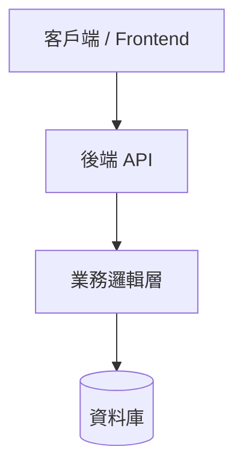

# Plan_【功能/階段名稱】實施計畫

> **建立日期**：{{DATE}}
> **狀態**：規劃中 / 審查中 / 已核准 / 執行中 / 已結案
> **負責人**：{{AUTHOR}}

---

## 🎯 1. 背景與目標 (Background & Goals)

### 1.1 背景說明
[描述為什麼要做這個功能/重構？解決了什麼業務痛點或技術債？]

### 1.2 核心目標 (Goals)
- [ ] 目標一：...
- [ ] 目標二：...

### 1.3 非本期目標 (Non-Goals / Out of Scope)
- 不包含：...

---

## 🏗️ 2. 技術架構與方案設計 (Architecture & Design)

### 2.1 方案概述
[簡述核心設計理念、資料流或系統架構]

### 2.2 資料庫變更 (Database Changes)
- 新增資料表 / 欄位：
- 索引與約束設計：

### 2.3 核心 API / 介面設計
- `POST /api/v1/...`
- `GET /api/v1/...`

---

## 🗓️ 3. 實施階段與任務拆解 (Phases & Tasks)

### Phase 1：基礎環境與 Schema
- [ ] 任務 1.1
- [ ] 任務 1.2

### Phase 2：業務邏輯開發與單元測試
- [ ] 任務 2.1
- [ ] 任務 2.2

### Phase 3：前後端整合與 UAT 驗證
- [ ] 任務 3.1
- [ ] 任務 3.2

---

## ⚠️ 4. 風險評估與備援方案 (Risks & Fallback)

| 風險項目 | 影響程度 (高/中/低) | 預防與備援措施 |
| :--- | :---: | :--- |
| 相容性問題 | 中 | 實作向後相容機制，並於 UAT 環境先期驗證 |
| 資料庫遷移失敗 | 高 | 執行前先 pg_dump / mysqldump 完整備份 |
