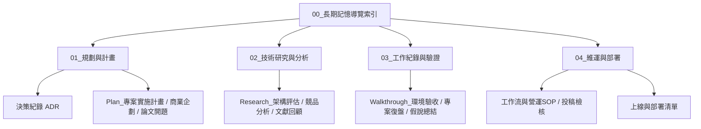

# 00_長期記憶導覽索引 (Master Index / MOC)

> **專案長期記憶地圖**：提供架構規劃、技術研究、驗證報告與維運部署文檔的完整雙向連結與時間演進脈絡。
> 供開發者在 Obsidian 中一目瞭然，並供 AI Agent 在新對話中快速獲取精準的檢索索引。
> 
> 💡 **專案入門與 SOP 指引**：[[專案使用指南|📖 專案知識庫使用指南 (How to Use)]]
> 📜 **架構開發歷程與反哺**：[[專案知識庫開發歷程|📜 專案知識庫開發歷程與架構演進]]
> 📝 **版本異動說明紀錄**：[[版本異動說明|📝 版本異動說明 (v2.3.0)]]
> 🧩 **進階選配體系指南**：[[_docs/選配體系使用指南|🧩 進階選配體系使用指南]]

---

## 📌 導覽地圖概觀 (Navigation Map)

---

## 🌐 Context 01~04 跨領域語意映射 (ADR-09)

本知識庫四層結構在不同專案領域中具備直覺的職能映射，提供對應的專業模板：

| 目錄板塊 | 軟體工程 (`Software*`) | 商業企劃 (`Business*`) | 論文研究 (`Research`) |
| :---: | :--- | :--- | :--- |
| **`01_規劃與計畫`** | 實施計畫 (`tpl_Plan`)、架構決策 (`tpl_ADR`) | 商業畫布 (`tpl_Lean_Canvas`)、商業計畫 (`tpl_Plan_Business`)、OKR (`tpl_OKR_Review`)、GTM策略 (`tpl_GTM_Strategy`) | 研究提案 (`tpl_Research_Proposal`)、研究假說 (Hypothesis) |
| **`02_技術研究與分析`** | 技術選型 (`tpl_Research`)、架構範式 (`patterns/`) | 競品矩陣 (`tpl_Competitor_Matrix`)、市場規模 (TAM/SAM/SOM)、客群畫像 (Persona) | 文獻探討 (`tpl_Literature_Review`)、理論架構、文獻比較矩陣 |
| **`03_工作紀錄與驗證`** | 驗收報告 (`tpl_Walkthrough`)、冒煙測試 (`tpl_Smoke_Test`) | 專案結案復盤 (`tpl_Walkthrough_Business`)、行銷漏斗 (`tpl_Marketing_Funnel`)、ROI數據 | 實驗日誌 (`tpl_Experiment_Log`)、假說總結 (`tpl_Research_Findings`) |
| **`04_維運與部署`** | 主機拓撲 (`tpl_Server_Environment`)、容器解析 (`tpl_Docker_Architecture`)、上線清單 | 營運標準作業程序 (SOP)、組織制度規範、跨團隊會議簡報 (`tpl_Meeting_Briefing`) | 投稿檢核清單 (`tpl_Paper_Submission_Checklist`)、審稿回覆表 (Rebuttal) |

---

## 📅 時序檔案索引目錄

### 🗺️ 01_規劃與計畫 (Planning & Roadmap)

| 建立日期 | 文件名稱 (雙向連結) | 核心範疇 / 目的 | 狀態 |
| :---: | :--- | :--- | :---: |
| {{CURRENT_DATE}} | [[_docs/context/01_規劃與計畫/決策紀錄\|決策紀錄]] | 紀錄專案重大技術、商業策略或研究方法決策 (ADR) | 🟢 維護中 |
| {{CURRENT_DATE}} | [[_docs/context/01_規劃與計畫/Plan_專案初始化與架構設計\|Plan_專案初始化與架構設計]] | 系統總體架構設計與 Phase 1 實施計畫 | 🟢 已核准 |

---

### 🔬 02_技術研究與分析 (Research & Architecture)

| 建立日期 | 文件名稱 (雙向連結) | 核心範疇 / 目的 | 類別 |
| :---: | :--- | :--- | :---: |
| {{CURRENT_DATE}} | [[_docs/context/02_技術研究與分析/Research_架構與技術選型評估\|Research_架構與技術選型評估]] | 框架、技術選型、競品比對或文獻綜述 | 調研報告 |

---

### 📝 03_工作紀錄與驗證 (Walkthroughs & Verification)

| 建立日期 | 文件名稱 (雙向連結) | 核心範疇 / 目的 | 驗證結果 |
| :---: | :--- | :--- | :---: |
| {{CURRENT_DATE}} | [[_docs/context/03_工作紀錄與驗證/Walkthrough_專案初始骨架與環境驗證\|Walkthrough_專案初始骨架與環境驗證]] | 本地環境建置、初始骨架驗證或成果復盤 | 🟢 驗證通過 |

---

### 🚀 04_維運與部署 (Operations & Deployment)

| 建立日期 | 文件名稱 (雙向連結) | 核心範疇 / 目的 | 類別 |
| :---: | :--- | :--- | :---: |
| {{CURRENT_DATE}} | [[_docs/context/04_維運與部署/工作流管理議題\|工作流管理議題]] | 分支策略、審查標準、營運SOP或投稿規範 | 規範指引 |
| {{CURRENT_DATE}} | [[_docs/context/04_維運與部署/上線與部署檢驗清單\|上線與部署檢驗清單]] | 上線前環境檢查、安全配置或投稿 Checklist | Checklist |
