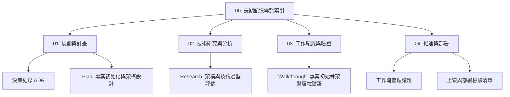

# 00_長期記憶導覽索引 (Master Index / MOC)

> **專案長期記憶地圖**：提供架構規劃、技術研究、驗證報告與維運部署文檔的完整雙向連結與時間演進脈絡。
> 供開發者在 Obsidian 中一目瞭然，並供 AI Agent 在新對話中快速獲取精準的檢索索引。
> 
> 💡 **專案入門與 SOP 指引**：[[專案使用指南|📖 專案知識庫使用指南 (How to Use)]]
> 📜 **架構開發歷程與反哺**：[[專案知識庫開發歷程|📜 專案知識庫開發歷程與架構演進]]
> 🧩 **進階選配體系指南**：[[_docs/選配體系使用指南|🧩 進階選配體系使用指南 (4大模組)]]

---

## 📌 導覽地圖概觀 (Navigation Map)

---

## 📅 時序檔案索引目錄

### 🗺️ 01_規劃與計畫 (Planning & Roadmap)

| 建立日期 | 文件名稱 (雙向連結) | 核心範疇 / 目的 | 狀態 |
| :---: | :--- | :--- | :---: |
| {{CURRENT_DATE}} | [[_docs/context/01_規劃與計畫/決策紀錄\|決策紀錄]] | 紀錄專案重大技術與架構決策 (ADR) | 🟢 維護中 |
| {{CURRENT_DATE}} | [[_docs/context/01_規劃與計畫/Plan_專案初始化與架構設計\|Plan_專案初始化與架構設計]] | 系統總體架構設計與 Phase 1 實施計畫 | 🟢 已核准 |

---

### 🔬 02_技術研究與分析 (Research & Architecture)

| 建立日期 | 文件名稱 (雙向連結) | 核心範疇 / 目的 | 類別 |
| :---: | :--- | :--- | :---: |
| {{CURRENT_DATE}} | [[_docs/context/02_技術研究與分析/Research_架構與技術選型評估\|Research_架構與技術選型評估]] | 框架、資料庫與授權評估對照 | 調研報告 |

---

### 📝 03_工作紀錄與驗證 (Walkthroughs & Verification)

| 建立日期 | 文件名稱 (雙向連結) | 核心範疇 / 目的 | 驗證結果 |
| :---: | :--- | :--- | :---: |
| {{CURRENT_DATE}} | [[_docs/context/03_工作紀錄與驗證/Walkthrough_專案初始骨架與環境驗證\|Walkthrough_專案初始骨架與環境驗證]] | 本地環境建置、Docker 容器啟動與骨架驗收 | 🟢 驗證通過 |

---

### 🚀 04_維運與部署 (Operations & Deployment)

| 建立日期 | 文件名稱 (雙向連結) | 核心範疇 / 目的 | 類別 |
| :---: | :--- | :--- | :---: |
| {{CURRENT_DATE}} | [[_docs/context/04_維運與部署/工作流管理議題\|工作流管理議題]] | Git 分支策略、代碼審查與資料庫防覆蓋守則 | 規範指引 |
| {{CURRENT_DATE}} | [[_docs/context/04_維運與部署/上線與部署檢驗清單\|上線與部署檢驗清單]] | 上線前環境檢查、安全配置與 Checklist | Checklist |
