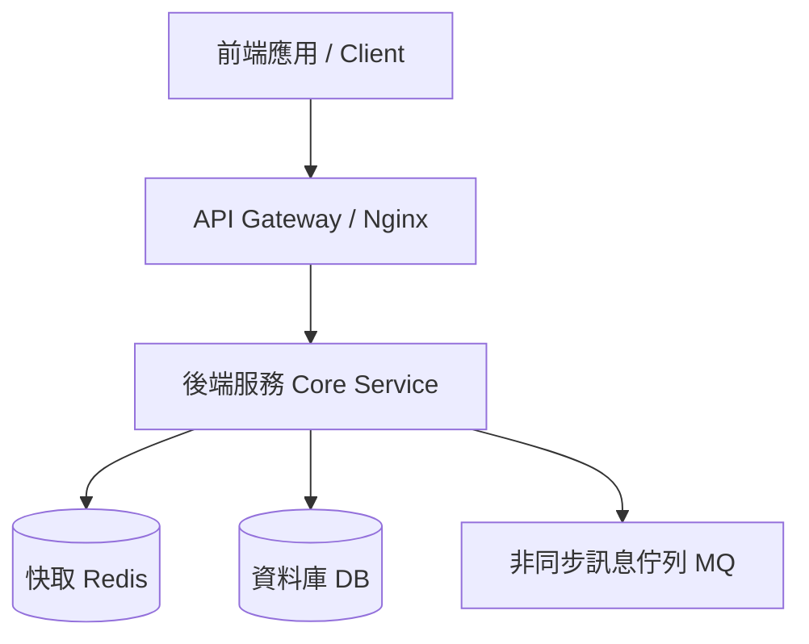

# Plan_專案初始化與架構設計

> **建立日期**：{{CURRENT_DATE}}
> **狀態**：🟢 已核准
> **負責人**：{{AUTHOR}}

---

## 🎯 1. 專案願景與核心目標

- **專案願景**：建立高效、穩定且可持續維護的 {{PROJECT_NAME}} 系統。
- **核心目標**：
  - [ ] 搭建現代化開發環境（Docker 化、熱重載支援）
  - [ ] 確立清晰的分層架構（Controller / Service / Repository / Model）
  - [ ] 建立自動化測試與代碼品質規範

---

## 🏗️ 2. 系統總體架構設計

### 2.1 分層架構職責
1. **API / Controller 層**：處理 HTTP 請求、參數校驗、回傳格式封裝。
2. **Service 業務層**：處理核心業務邏輯、交易事務控制 (Transaction)。
3. **Repository / Data Access 層**：封裝資料庫查詢與 ORM 操作。

---

## 🗓️ 3. 階段規劃 (Roadmap)

### Phase 1：骨架建置與環境配置
- [x] 建立知識庫與代碼倉庫
- [ ] 配置 `docker-compose.yml` 基礎容器
- [ ] 完成健康檢查端點（`GET /health`）

### Phase 2：核心功能模組開發
- [ ] 核心資料庫結構設計與 Migration 腳本
- [ ] 核心業務邏輯 API 開發

### Phase 3：整合驗證與上線部署
- [ ] 單元測試覆蓋與整合驗收
- [ ] 雲端環境部署與上線檢驗
