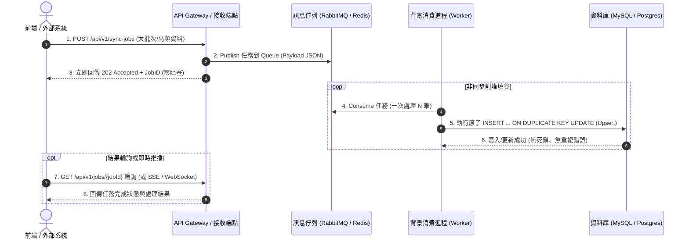

# ⚡ 非同步 MQ 佇列 ＋ 原子 Upsert 高併發抗壓架構範式

> **適用情境**：面臨高頻資料同步、大批次匯入、瞬間尖峰並發請求，且資料庫出現 `Duplicate entry`、死鎖 (Deadlock) 或 API 連線超時。
> **來源實踐**：`machan_smart_production_backend` (PHP Slim + RabbitMQ + MySQL Upsert)

---

## 🏗️ 1. 架構拓撲與資料流向



---

## 💡 2. 三大核心設計守則 (Core Principles)

### 守則一：前後端非同步解耦（前端絕不直連 MQ）
- 前端僅透過 HTTP REST API 發送請求並獲取 `jobId`，絕不讓瀏覽器直接連線 MQ Broker，確保系統安全性與連線數控制。

### 守則二：原子性 Upsert（徹底取代「先刪後加 Delete-then-Add」）
- 傳統非原子性的「先 DELETE 舊資料 ➔ 再 INSERT 新資料」在多線程並發時極易引發 Race Condition 與重複鍵錯誤。
- **標準解法**：全面改為原子級的 `INSERT ... ON DUPLICATE KEY UPDATE`：
```sql
INSERT INTO manufacture_order (order_no, customer_id, status, updated_at)
VALUES (:order_no, :customer_id, :status, NOW())
ON DUPLICATE KEY UPDATE
    status = VALUES(status),
    updated_at = NOW();
```

### 守則三：結果獲取機制 (Result Retrieval)
- **方案 A（簡單通用）**：前端每隔 2~3 秒輪詢 `GET /api/v1/jobs/{jobId}`。
- **方案 B（即時省流）**：後端處理完成後發送 Redis Pub/Sub，由 SSE (Server-Sent Events) 伺服器主動推播完成通知給前端。
