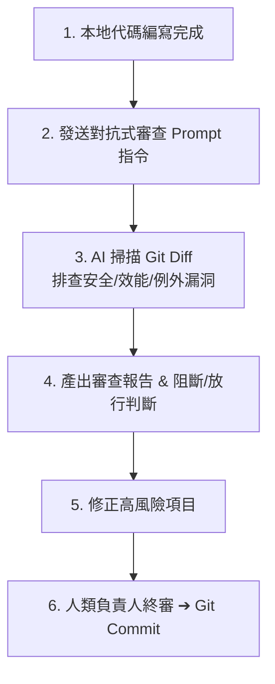

# 🔍 對抗式代碼資安審查工作流 SOP (Adversarial Code Review)

> 本 SOP 規範在開發完成、準備進行 `git commit` 與 Push 之前，如何叫 AI 切換為 **「嚴苛的資深資安架構師 / 滲透測試員」** 視角，對本次代碼變更進行極限挑刺與安全加固。

---

## 🧭 工作流核心流程



---

## 🤖 標準呼叫 Prompt（直接複製貼給 AI）

```text
請暫時放下開發者身分，切換為「嚴苛的資安架構師與黑客滲透測試員」視角。
請讀取本次所有代碼倉庫的 Git Diff (或未提交的暫存變更)，進行極限挑刺審查：

重點排查以下項目：
1. 【資安盲點】：是否有任何 SQL 拼接、未轉義的 XSS 渲染、或未驗證權限的水平越權存取？
2. 【例外與韌性】：是否有外部 I/O 缺少 Timeout (<= 5s)？是否有第三方 SDK 報錯會導致全站 500 癱瘓？
3. 【資料保護】：是否有任何資料庫死鎖風險、或缺乏原子 Upsert / 交易保護？
4. 【個資與日誌】：是否在日誌中意外印出了 Token、密碼或用戶機密資料？

請產出審查缺失清單，並給予「🟢 放行」或「🔴 阻斷修復」結論。
```

---

## 📋 審查結果判定標準

- **🔴 阻斷 (BLOCK)**：發現重大資安漏洞（如 SQL 注入、未授權 API 端點、伺服器密鑰硬編碼）。**必須立即修復才可 Commit**。
- **🟡 警告 (WARNING)**：代碼風格不佳、缺乏 Timeout 設定、缺少日誌。**建議修復或記入技術債**。
- **🟢 通過 (PASS)**：代碼品質堅固，無架構缺陷，由負責人進行最終手動 Commit。
