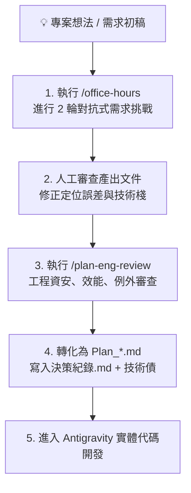

# 🤖 gstack 虛擬團隊對抗審查工作流 SOP (gstack Review Workflow)

> 本 SOP 規範如何使用 **gstack** 技能庫進行專案前期的「產品假設挑戰」與「工程資安審查」，並無縫將審查成果轉化為 `obs-temp` 的標準計畫文件。

---

## 🧭 工作流核心流程



---

## 🛠️ 操作步驟

### 步驟 1：安裝 gstack（全域一次性安裝）
```bash
git clone https://github.com/garrytan/gstack.git ~/.claude/skills/gstack
cd ~/.claude/skills/gstack && ./setup
```

### 步驟 2：執行 `/office-hours`（需求探索與審查）
在專案目錄下執行：
```text
/office-hours
請用繁體中文進行所有問答，產出文件也請用繁體中文。
```
- **審查重點**：挑戰「這個功能真的是使用者要的嗎？」、「MVP 邊界是否過大？」。
- **產出**：產出 Design Doc（存於 `~/.gstack/projects/[project]/`）。

### 步驟 3：人工審查與技術棧修訂
- 人工審查產出內容，若有技術棧調整（例如將 React 改為原生 HTML/PHP 以降低門檻），直接在文件註記修正，不需重跑。

### 步驟 4：執行 `/plan-eng-review`（工程架構審查）
在專案目錄下執行：
```text
/plan-eng-review
```
- **審查重點**：Token aud 驗證、SQL 注入、5s timeout、例外隔離、個資隱私（PDPA）。
- **目標**：達成 **CLEAN（0 未解決項目）**。

### 步驟 5：歸檔與轉化至 `obs-temp`
1. 將通過審查的 Design Doc 轉化並收納為 `_docs/context/01_規劃與計畫/Plan_【功能名稱】.md`。
2. 將審查中的重大決策寫入 `_docs/context/01_規劃與計畫/決策紀錄.md`。
3. 將延後事項收納至 `_docs/技術債與延後決策.md`。
