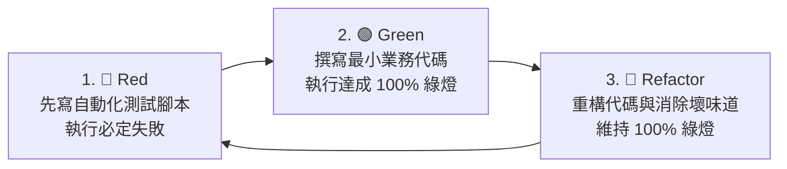

# 🔴🟢 AI 驅動的 TDD 測試先行工作流 SOP (Test-Driven Development)

> 本 SOP 規範在開發核心業務邏輯（如計薪計算、勞健保精算、工單狀態流轉）時，如何透過 **「測試腳本先行 ➔ 寫碼通過 ➔ 重構」** 的閉環保證 100% 準確性。

---

## 🧭 TDD 核心循環



---

## 🛠️ 操作步驟

### 步驟 1：定義介面與產出測試腳本 (Red 🔴)
在尚未撰寫任何 Service 邏輯前，要求 AI 建立測試腳本（例如 `scratch/test_salary_calc.php` 或 `tests/test_order.py`）：
```text
請根據 Plan_勞健保計算.md 中的規格，先在 scratch/test_calc.php 建立一組包含 10 個極端邊界案例的自動化測試腳本。
此時執行此腳本必須為 Failed (紅燈)。
```

### 步驟 2：撰寫業務邏輯以通過測試 (Green 🟢)
讓 AI 編寫 Controller / Service 代碼，直到測試腳本跑出 100% 綠燈：
```text
現在請撰寫 src/services/SalaryService.php 業務代碼，
執行 scratch/test_calc.php 直到所有 10 個案例全部 PASS (綠燈)。
```

### 步驟 3：重構優化 (Refactor 🔵)
在保持測試全數通過的前提下，優化代碼可讀性與模組解耦。

### 步驟 4：將測試成果寫入 Walkthrough
將 100% 綠燈的執行終端輸出，直接貼入 `Walkthrough_【功能名稱】.md` 作為權威驗收證據。
