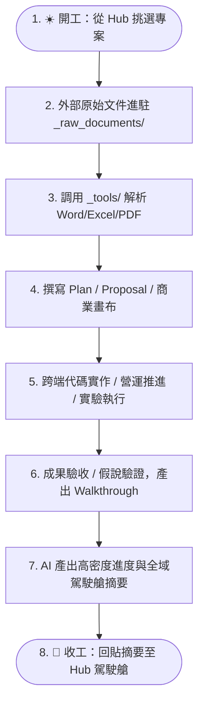

# 📖 專案知識庫使用指南 (How to Use This Template)

> 本文件詳細說明 **`obs-temp` 專案知識管理樣版 (v2.4.0 基礎設施多領域擴充版)** 的設計哲學、目錄規範、Hub-and-Spoke 雙層架構、跨領域多態性（軟體 / 商業 / 研究 / 基礎設施）、Antigravity 多工作區協作、零依賴工具鏈與原始文件萃取流轉機制。
> 
> 📝 **版本異動紀錄**：[[版本異動說明|📝 版本異動說明 (v2.4.0)]] ｜ 📜 **架構歷程**：[[專案知識庫開發歷程|📜 專案知識庫開發歷程與架構演進]]

---

## 🧭 目錄導覽

1. [核心設計哲學（雙庫解耦 ＋ Hub-and-Spoke 雙層架構 ＋ 跨領域多態性）](#1-核心設計哲學)
2. [如何快速啟動一個新專案（軟體工程、商業管理、學術研究、基礎設施）](#2-如何快速啟動一個新專案)
3. [目錄結構與職責分工（含領域專屬模板與裁剪機制）](#3-目錄結構與職責分工)
4. [Antigravity 多工作區協作實戰手冊](#4-antigravity-多工作區協作實戰手冊)
5. [標準開發與研究生命週期工作流（從規劃到結案 SOP）](#5-標準開發與研究生命週期工作流)
6. [AI 助手（Claude / Antigravity / Gemini / Cursor）協作最佳實踐](#6-ai-助手協作最佳實踐)
7. [檔案命名與雙向連結規範](#7-檔案命名與雙向連結規範)
8. [Git 版本控制與資安防護守則](#8-git-版本控制與資安防護守則)
9. [輕量級工具庫與原始規格文檔萃取 SOP](#9-輕量級工具庫與原始規格文檔萃取-sop)
10. [架構演進與專案實務反哺機制 (Upstream Feedback Loop)](#10-架構演進與專案實務反哺機制)
    - 📜 模板詳細歷史：[[專案知識庫開發歷程|專案知識庫開發歷程與架構演進]]
    - 📝 最新版本異動：[[版本異動說明|版本異動說明 (v2.4.0)]]

---

## 1. 核心設計哲學

本樣版歷經大型軟體系統、企業 ERP 串接、商業市場營運、科研專案與雲端基礎設施維運之實戰淬煉，核心架構圍繞四大支柱與多領域多態性：

```
┌─────────────────────────────────────────────────────────────────────────┐
│ 1. 雙庫解耦：知識庫 (Docs Vault) ⟷ 實體資源庫 (Git / 雲端 / 數據) 物理隔離   │
│ 2. 樞紐拓撲：總管理駕駛艙 (Hub: workIdeax / obs-and) ⟷ 專案深度大腦 (Spoke)   │
│ 3. 長短分流：日常主控看板 (Active) ⟷ 長期記憶庫 (Context: 規劃/研究/驗收/維運)  │
│ 4. 領域多態：軟體 (Software) ｜ 商業 (Business) ｜ 科研 (Research) ｜ 維運 (Infra)│
└─────────────────────────────────────────────────────────────────────────┘
```

### 🌟 Hub-and-Spoke 雙層架構運作模式
- **總管理駕駛艙（Hub 雙軌分流）**：
  - 🏢 **公司/客戶專案**：對齊 **`workIdeax`**（負責公司專案優先級、工時排程與宏觀里程碑）。
  - 🛸 **個人/學習/研究**：對齊 **`obs-and`**（負責個人目標、技術深造、學術研究與生涯規劃）。
- **專案深度大腦（Spoke: `obs-[專案]`）**：
  - 負責「深鑽視角 (Micro View)」：管理單一專案的實體架構、API、RACI 業務流程、實驗數據、UAT 測試截圖與完整 ADR。
  - **好處**：作業時 100% 聚焦當前專案；在 Antigravity 同時掛載「Hub + Spoke + 實體資源」時，收工指令能自動雙層寫入，免手動複製貼上！

---

## 2. 如何快速啟動一個新專案

### ⚡ 使用開箱 PowerShell 腳本：`init-new-project.ps1`（v2.3.0 跨領域多態支援）

腳本內建**波斯泰爾容錯法則 (Postel's Law - ADR-07)**，支援 PascalCase、kebab-case 以及舊版相容別名：

#### 🟢 情境 A：軟體工程專案 (`Software*`)

```powershell
cd D:\_obs\obs-temp

# 1. 全新從 0 到 1 專案 (預設 SoftwareGreenField，亦相容 -Mode "GreenField")
.\init-new-project.ps1 -ProjectKey "crm-v2" -ProjectName "新世代CRM系統"

# 2. 既有舊系統模組擴充 / 多倉庫協同 (支援具名 RepoMap)
.\init-new-project.ps1 `
    -ProjectKey "eirgenix" `
    -ProjectName "台康費用報支系統" `
    -Mode "SoftwareLegacy" `
    -RepoMap @{
        "後端 API" = "D:\_giti3\eirgenix_backend";
        "前端 Web" = "D:\_giti3\eirgenix_frontend";
    }
```

#### 💼 情境 B：商業管理與市場出海專案 (`Business*`)

```powershell
# 1. 綜合商業企劃與 OKR 管理 (寬鬆 kebab-case: business)
.\init-new-project.ps1 `
    -ProjectKey "corp-2026" `
    -ProjectName "2026年度組織變革與營運企劃" `
    -Mode "business"

# 2. 市場出海與 GTM 策略 (支援雲端與 NAS 營運資源)
.\init-new-project.ps1 `
    -ProjectKey "apac-gtm" `
    -ProjectName "亞太品牌出海專案" `
    -Mode "business-market" `
    -RepoMap @{
        "CRM 系統" = "https://crm.company.com";
        "共用 NAS" = "D:\_nas\marketing_assets";
        "GA4 看板" = "https://analytics.google.com"
    }
```

#### 🎓 情境 C：學術論文與科研專案 (`Research`)

```powershell
# 學術研究專案 (綁定原始數據集與文獻庫)
.\init-new-project.ps1 `
    -ProjectKey "thesis-eeg" `
    -ProjectName "腦波訊號深度學習分析研究" `
    -Mode "Research" `
    -RepoMap @{
        "原始腦電數據" = "D:\_datasets\eeg_raw";
        "特徵提取腳本" = "D:\_research\pipeline";
        "Zotero 文獻庫" = "D:\_zotero\neuro_ai"
    }
```

#### 🛠️ 情境 D：雲端基礎設施與主機維運專案 (`Infrastructure`)

```powershell
# 雲端架構、主機維護與高併發系統 (支援 GCP / Cloudflare / 自建實體主機)
.\init-new-project.ps1 `
    -ProjectKey "infra" `
    -ProjectName "雲端基礎設施與主機維運" `
    -Mode "Infrastructure" `
    -RepoMap @{
        "GCP 雲端專案" = "GCP Console / asia-east1";
        "Cloudflare 邊緣" = "Cloudflare Dashboard";
        "自建 AI Server" = "192.168.1.100 / SSH";
    }
```

> **腳本自動完成**：
> 1. 自動複製產生 `obs-[專案代號]`，攜帶 `_tools/` 與 `_docs/_raw_documents/`。
> 2. **動態資源表格 (ADR-08)**：依領域自動切換為 Git 代碼庫、營運資源、研究數據庫或雲端基礎設施表格。
> 3. **資產自動裁剪 (ADR-10)**：依領域自動保留專屬模板，乾淨移除無關領域之檔案與選配庫，保證 100% 零雜訊。
> 4. **AI 提示詞自動切換**：依領域自動將對應之 `CLAUDE_<Domain>.md` 變體啟用為專屬 `CLAUDE.md`。

---

## 3. 目錄結構與職責分工

母模板 `obs-temp` 完整收錄全領域資產，開箱後會依據所選領域**精確裁剪**：

```text
D:\_obs\obs-[專案名稱]/
│
├── CLAUDE.md                              # 🤖 AI 助手全域記憶入口（依模式自動注入對應領域版）
├── README.md                               # 🏠 專案首頁儀表板（資源清單與全域跳轉圖）
├── 專案使用指南.md                         # 📖 本指南文件
├── 版本異動說明.md                         # 📝 樣版演進 Changelog
├── 專案知識庫開發歷程.md                   # 📜 架構起源、重大 ADR 與反哺 SOP
│
├── _tools/                                 # 🛠️ 輕量級零依賴工具庫（純 Python 標準庫，全領域通用）
│   ├── README.md                           # 工具庫使用指引
│   ├── read_docx.py                        # Word (.docx) 純文字提取工具
│   ├── read_xlsx.py                        # Excel (.xlsx) 表格提取與工作表探測工具
│   ├── probe_health.py                     # HTTP 端點健康與延遲探測工具
│   └── deploy_template.py.sample           # 遠端部署與快取重啟範本
│
├── _docs/                                  # ⚡ 日常動態維護看板（高頻讀寫）
│   ├── 待辦.md                             # 📋 當前進行中、待排程與已完成的任務清單
│   ├── 工作日誌.md                         # 📝 每日開發/營運/實驗紀錄（最新在最上方）
│   ├── 專案索引.md                         # 🗺️ 專案資源對照、模組與文件導覽地圖
│   │
│   ├── _raw_documents/                     # 📥 外部原始規格文檔池（只讀輸入源頭：客戶Word/報表/文獻PDF）
│   │   └── README.md                       # 原始文檔管理規範與生命週期
│   │
│   ├── _templates/                         # 📄 領域專屬標準模板庫
│   │   ├── tpl_ADR.md                      # 🏛️ 決策紀錄通用條目模板 (全領域適用)
│   │   │
│   │   ├── infra/                          # 🛠️ 基礎設施專屬模板庫 (Infrastructure 模式專屬)
│   │   │   ├── tpl_High_Concurrency_Architecture.md # 高併發架構規劃 (CDN/LB/MQ/Redis/DB讀寫分流)
│   │   │   ├── tpl_Host_Maintenance_SOP.md # 主機日常維護、磁碟清理與安全重啟 SOP
│   │   │   ├── tpl_Disaster_Recovery_Plan.md # 備份驗證、快照封存與災難復原演練
│   │   │   └── tpl_Security_Audit_Plan.md  # 資安防護、弱點掃描修復與憑證管理
│   │   │
│   │   ├── business/                       # 💼 商業管理專屬模板庫 (Business* 模式專屬)
│   │   │   ├── tpl_Plan_Business.md        # 通用商業專案實施計畫 (含 As-Is/To-Be 與 RACI)
│   │   │   ├── tpl_Walkthrough_Business.md # 商業專案結案驗收與復盤 (含 KPI/ROI 驗證)
│   │   │   ├── tpl_Lean_Canvas.md          # 9 宮格精實商業模式畫布
│   │   │   ├── tpl_OKR_Review.md           # OKR 季/月度檢視與信心打分
│   │   │   ├── tpl_GTM_Strategy.md         # 市場進入策略 (TAM/SAM/SOM 漏斗與 4P)
│   │   │   ├── tpl_Competitor_Matrix.md    # 競品定價/功能對照矩陣 (SWOT 與 Persona)
│   │   │   └── tpl_Marketing_Funnel.md     # AARRR 行銷漏斗數據與 Post-Mortem
│   │   │
│   │   ├── research/                       # 🎓 學術研究專屬模板庫 (Research 模式專屬)
│   │   │   ├── tpl_Research_Proposal.md    # 研究計畫與問題陳述 (RQ/H 假說鏈與 Pipeline)
│   │   │   ├── tpl_Literature_Review.md    # 文獻探討筆記 (單篇文獻卡與比較矩陣)
│   │   │   ├── tpl_Experiment_Log.md       # 實驗環境與變因控制日誌 (IV/DV/CV 表格)
│   │   │   ├── tpl_Research_Findings.md    # 階段假說驗證與成果總結 (假說判定與消融分析)
│   │   │   └── tpl_Paper_Submission_Checklist.md # 投稿檢核與 Point-by-Point 審稿回覆
│   │   │
│   │   └── optional/                       # 📦 進階選配模板
│   │       ├── tpl_Meeting_Briefing.md     # 🗣️ 跨團隊/顧問會議溝通與發言要點模板 (軟體/商業)
│   │       ├── tpl_Project_Showcase.md     # 🏆 專案成果展示萃取 (軟體/商業)
│   │       ├── tpl_AI_Chat_Summary.md      # 💡 深度排錯/除錯避坑卡片 (全領域)
│   │       └── tpl_obs_temp_enhancement_proposal.md # 🔄 母版架構增強反哺建議書 (全領域)
│   │
│   └── context/                            # 🏛️ 長期記憶庫（Master MOC，四層結構跨領域語意映射）
│       ├── 00_長期記憶導覽索引.md           # 雙向連結地圖（所有歷史文件之樞紐）
│       ├── 01_規劃與計畫/                  # Plan、提案、商業畫布、決策紀錄 (ADR)
│       ├── 02_技術研究與分析/              # Research、文獻探討、競品矩陣、架構評估
│       ├── 03_工作紀錄與驗證/              # Walkthrough、實驗數據、假說判定、專案復盤
│       └── 04_維運與部署/                  # 部署SOP、營運制度、投稿檢核與審稿回覆
```

---

## 4. Antigravity 多工作區協作實戰手冊

在 Antigravity 中建立專案時，推薦將**「知識庫」與「關聯實體資源/代碼庫」同時加入同一個 Workspace**：

```text
Antigravity 單一工作區視窗：
  ├── D:\_obs\obs-eirgenix       (知識中樞：Plan / ADR / 日誌 / MOC / _tools)
  ├── D:\_giti3\eirgenix-backend (後端代碼庫)
  └── D:\_giti3\eirgenix-frontend(前端代碼庫)
```

- **全域上帝視角**：AI 在對話中一邊讀取知識庫的實施計畫或文獻筆記，一邊直接跨目錄編寫代碼或處理數據，實現無縫跨端協同。

---

## 5. 標準開發與研究生命週期工作流



---

## 6. AI 助手協作最佳實踐

新專案開箱後，`CLAUDE.md` 已依據領域自動配置最佳指令：

| 領域 | 核心場景 | 推薦 Prompt 指令摘要 |
| :--- | :--- | :--- |
| **軟體工程** | 結束工作 | `請依據今日產出更新 CLAUDE.md 目前進度（含前端/後端Commit、編譯目標、實機驗收），追加工作日誌，輸出全域摘要。` |
| **商業管理** | 結束工作 | `請更新 CLAUDE.md 目前進度（含策略對齊、營運推進、指標數據、跨部門協同），追加工作日誌，輸出全域摘要。` |
| **商業企劃** | 發起新案 | `請參考 tpl_Plan_Business.md，為 [專案名稱] 撰寫實施計畫書，包含 As-Is/To-Be 流程圖與 RACI 矩陣。` |
| **學術研究** | 假說總結 | `請參考 tpl_Research_Findings.md，匯總多份 Experiment Log，對 H1~H3 假說給出判定結論與消融分析。` |
| **跨領域** | 原始資產 | `請執行 python _tools/read_xlsx.py [路徑] --list-sheets 探測工作表，並將核心規格表格轉換為 Markdown 計畫草案。` |

---

## 7. 檔案命名與雙向連結規範

1. **前綴規則**：
   - 計畫/提案：**`Plan_`** 或 **`Research_Proposal_`**
   - 調研/文獻：**`Research_`** 或 **`Literature_Review_`**
   - 驗收/總結：**`Walkthrough_`** 或 **`Research_Findings_`**
   - 實驗日誌：**`Experiment_Log_`**
2. **雙向連結維護**：
   - 任何新建於 `context/` 的檔案，都要同步加入 [`00_長期記憶導覽索引.md`](file:///D:/_obs/obs-temp/_docs/context/00_%E9%95%B7%E6%9C%9F%E8%A8%98%E6%86%B6%E5%B0%8E%E8%A6%BD%E7%B4%A2%E5%BC%95.md)。

---

## 8. Git 版本控制與資安防護守則

1. **獨立 Git 控管**：知識庫本身為獨立 Git 倉庫，負責版本控管所有計畫、研究與架構圖。
2. **資安深度防禦（已內建於 `.gitignore`）**：
   - 自動忽略 VPN 憑證、私鑰（`*.ovpn`, `*.key`, `*.pem`, `*.p12`, `*.id_rsa`）。
   - 自動忽略本地敏感檔案（`*_local_credentials.md`, `*_secret*.md`）。
   - 自動忽略大型二進位壓縮檔（`*.zip`, `*.tar.gz`, `*.iso`，大型數據集建議放外部儲存）。

---

## 9. 輕量級工具庫與原始規格文檔萃取 SOP

1. 將外部交付的檔案放入 `_docs/_raw_documents/`（保持只讀）。
2. 在終端機調用 `_tools/` 零依賴腳本提取文字或表格：
   - **Word 解析**：`python _tools/read_docx.py _docs/_raw_documents/規格.docx -o 輸出.md`
   - **Excel 解析**：`python _tools/read_xlsx.py _docs/_raw_documents/數據.xlsx --list-sheets`，再指定分頁產出 Markdown 表格。
   - **端點探測**：`python _tools/probe_health.py http://localhost:8080/api/health`。
3. 提取後的內容經 AI 整理後存入 `_docs/context/01_規劃與計畫/`。

---

## 10. 架構演進與專案實務反哺機制 (Upstream Feedback Loop)

在真實專案中，實務往往走在模板前面。派生專案淬煉出的優良架構或模板，可透過「兩階段解耦反哺模式」逆向回饋給母模板 `obs-temp`。

詳細歷程與決策脈絡請參閱：[[專案知識庫開發歷程|📜 專案知識庫開發歷程與架構演進]]。

### 🛡️ 核心原則：無雜訊原則 (Zero-Noise Principle)
- ❌ **日常不打擾**：AI 在日常高頻作業時**絕對不進行自動提醒**，避免警報疲勞。
- ✅ **關鍵時機主動發起**：僅在專案完成「重大功能里程碑 (Milestone Walkthrough)」、「架構重構」或「專案結案」時觸發。

### 🚀 兩階段操作 SOP
1. **階段 1（派生專案現場）**：使用 `tpl_obs_temp_enhancement_proposal` 產出建議書。
2. **階段 2（母版工作區）**：跨庫讀取建議書，完成去業務化並升級母版，記錄演進歷程。
