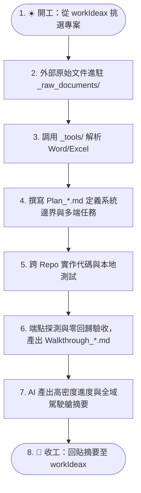

# 📖 專案知識庫使用指南 (How to Use This Template)

> 本文件詳細說明 **`obs-temp` 專案知識管理樣版 (v2.2.0)** 的設計哲學、目錄規範、Hub-and-Spoke 雙層架構、Antigravity 多工作區協作、零依賴工具鏈與原始文件萃取流轉機制。
> 
> 📝 **版本異動紀錄**：[[版本異動說明|📝 版本異動說明 (v2.2.0)]] ｜ 📜 **架構歷程**：[[專案知識庫開發歷程|📜 專案知識庫開發歷程與架構演進]]

---

## 🧭 目錄導覽

1. [核心設計哲學（雙庫解耦 ＋ Hub-and-Spoke 雙層架構）](#1-核心設計哲學)
2. [如何快速啟動一個新專案（支援全新、舊系統擴充與具名多倉庫）](#2-如何快速啟動一個新專案)
3. [目錄結構與職責分工](#3-目錄結構與職責分工)
4. [Antigravity 多工作區協作實戰手冊](#4-antigravity-多工作區協作實戰手冊)
5. [標準開發生命週期工作流（從規劃到結案 SOP）](#5-標準開發生命週期工作流從規劃到結案-sop)
6. [AI 助手（Claude / Antigravity / Gemini / Cursor）協作最佳實踐](#6-ai-助手協作最佳實踐)
7. [檔案命名與雙向連結規範](#7-檔案命名與雙向連結規範)
8. [Git 版本控制與資安防護守則](#8-git-版本控制與資安防護守則)
9. [輕量級工具庫與原始規格文檔萃取 SOP](#9-輕量級工具庫與原始規格文檔萃取-sop)
10. [架構演進與專案實務反哺機制 (Upstream Feedback Loop)](#10-架構演進與專案實務反哺機制)
    - 📜 模板詳細歷史：[[專案知識庫開發歷程|專案知識庫開發歷程與架構演進]]
    - 📝 最新版本異動：[[版本異動說明|版本異動說明 (v2.2.0)]]

---

## 1. 核心設計哲學

本樣版基於大型專案（Odoo 跨版本遷移、ezvas 電子工單多倉庫系統、eirgenix 企業費用報支與 ERP 串接）實戰經驗提煉而成，核心架構圍繞四大支柱：

```
┌─────────────────────────────────────────────────────────────────────────┐
│ 1. 雙庫解耦：知識庫 (Docs Vault) ⟷ 程式碼倉庫 (Multi-Repo Git) 物理隔離       │
│ 2. 樞紐拓撲：總管理駕駛艙 (Hub: workIdeax) ⟷ 專案深度大腦 (Spoke: obs-[proj])   │
│ 3. 長短分流：日常主控看板 (Active) ⟷ 長期記憶庫 (Context: 規劃/研究/驗收/維運)  │
│ 4. 閉環演進：輸入 (Raw) ➔ 萃取 (_tools) ➔ 計畫 (Plan) ➔ 決策 (ADR) ➔ 驗收      │
└─────────────────────────────────────────────────────────────────────────┘
```

### 🌟 Hub-and-Spoke 雙層架構運作模式
- **總管理駕駛艙（Hub 雙軌分流）**：
  - 🏢 **公司/客戶專案**：對齊 **`workIdeax`**（負責公司專案優先級、工時排程與宏觀里程碑）。
  - 🛸 **個人/學習專案**：對齊 **`obs-and`**（負責個人生涯目標、技術養成、靈修與個人計畫）。
- **專案深度大腦（Spoke: `obs-[專案]`）**：
  - 負責「深鑽視角 (Micro View)」：管理單一系統的實體架構、API 定義、多倉庫代碼修改、UAT 測試截圖與完整日誌。
  - **好處**：寫代碼時 100% 聚焦當前專案，公私物理隔離；在 Antigravity 同時掛載「Hub + Spoke + 代碼庫」時，收工指令能自動雙層寫入，免手動複製貼上！

---

## 2. 如何快速啟動一個新專案

### ⚡ 使用開箱 PowerShell 腳本：`init-new-project.ps1`（雙軌向下相容）

打開 PowerShell，進入本範本目錄：

#### 🟢 情境 A：最簡全新專案（GreenField）
```powershell
cd D:\_obs\obs-temp
.\init-new-project.ps1 -ProjectKey "crm-v2" -ProjectName "新世代CRM系統"
```

#### 🔵 情境 B：多代碼倉庫（向下相容陣列模式）
```powershell
cd D:\_obs\obs-temp
.\init-new-project.ps1 `
    -ProjectKey "ezvas" `
    -ProjectName "ezvas電子工單系統" `
    -Mode "LegacyModule" `
    -RepoPaths "D:\_giti3\ezvas-backend", "D:\_giti3\ezvas-frontend", "D:\_giti3\ezvas-admin"
```

#### 🟣 情境 C：新版推薦 — 具名代碼倉庫（RepoMap 雜湊模式）
```powershell
cd D:\_obs\obs-temp
.\init-new-project.ps1 `
    -ProjectKey "eirgenix" `
    -ProjectName "台康費用報支系統" `
    -Mode "LegacyModule" `
    -RepoMap @{
        "後端 API" = "D:\_giti3\eirgenix_backend";
        "前端 Web" = "D:\_giti3\eirgenix_frontend";
    }
```

> **腳本自動完成**：
> 1. 自動在 `D:\_obs\` 複製產生 `obs-[專案代號]`，完整攜帶 `_tools/` 與 `_docs/_raw_documents/`。
> 2. 自動將多個 Git 路徑格式化為 Markdown 表格並填入 `CLAUDE.md`、`README.md`、`專案索引.md`。
> 3. 自動置換所有模板變數（`{{PROJECT_KEY}}`、`{{PROJECT_NAME}}` 等）。

---

## 3. 目錄結構與職責分工

```text
D:\_obs\obs-[專案名稱]/
│
├── CLAUDE.md                              # 🤖 AI 助手全域記憶入口、多倉庫路徑與常用 Prompt
├── README.md                               # 🏠 專案首頁儀表板（Mermaid 全域跳轉圖與 Repo 清單）
├── 專案使用指南.md                         # 📖 本指南文件
├── 版本異動說明.md                         # 📝 樣版演進 Changelog
├── 專案知識庫開發歷程.md                   # 📜 架構起源、重大 ADR 與反哺 SOP
│
├── _tools/                                 # 🛠️ 輕量級零依賴工具庫（純 Python 標準庫）
│   ├── README.md                           # 工具庫使用指引
│   ├── read_docx.py                        # Word (.docx) 純文字提取工具
│   ├── read_xlsx.py                        # Excel (.xlsx) 表格提取與工作表探測工具
│   ├── probe_health.py                     # HTTP 端點健康與延遲探測工具
│   └── deploy_template.py.sample           # 遠端部署與快取重啟範本
│
├── _docs/                                  # ⚡ 日常動態維護看板（高頻讀寫）
│   ├── 待辦.md                             # 📋 當前進行中、待排程與已完成的任務清單
│   ├── 工作日誌.md                         # 📝 每日開發/測試/除錯紀錄（最新在最上方）
│   ├── 專案索引.md                         # 🗺️ 多倉庫對照、模組與文件導覽地圖
│   ├── 選配體系使用指南.md                 # 🧩 進階選配庫使用手冊
│   │
│   ├── _raw_documents/                     # 📥 外部原始規格文檔池（只讀輸入源頭）
│   │   └── README.md                       # 原始文檔管理規範與生命週期
│   │
│   ├── _templates/                         # 📄 標準文件空白模板庫
│   │   ├── tpl_Plan.md                     # 實施計畫模板（含整合邊界、防腐層、多端任務）
│   │   ├── tpl_Walkthrough.md              # 工作總結驗收模板（含多端變更清單、零回歸驗證）
│   │   ├── tpl_ADR.md                      # 架構決策紀錄條目模板
│   │   ├── tpl_Research.md                 # 技術調研分析模板（含舊系統相容性探勘）
│   │   ├── tpl_Server_Environment.md       # 🖥️ 伺服器環境拓撲與連線管理模板
│   │   ├── tpl_Docker_Architecture.md      # 🐳 主機容器運行環境與網絡拓撲深度解析模板
│   │   └── optional/                       # 📦 進階選配模板
│   │       ├── tpl_Meeting_Briefing.md     # 🗣️ 跨團隊/顧問會議溝通與發言要點模板
│   │       ├── tpl_Eng_Review.md           # 🛡️ 資安與工程架構審查模板
│   │       ├── tpl_Smoke_Test.md           # 🧪 冒煙測試用例庫
│   │       ├── tpl_Project_Showcase.md     # 🏆 專案成果展示萃取
│   │       └── tpl_AI_Chat_Summary.md      # 💡 深度排錯避坑卡片
│   │
│   └── context/                            # 🏛️ 長期記憶庫（Master MOC）
│       ├── 00_長期記憶導覽索引.md           # 雙向連結地圖（所有歷史文件之樞紐）
│       ├── 01_規劃與計畫/                  # Plan_*.md、決策紀錄.md (ADR)
│       ├── 02_技術研究與分析/              # Research_*.md、架構比對、技術選型
│       ├── 03_工作紀錄與驗證/              # Walkthrough_*.md、UAT 測試報告
│       └── 04_維運與部署/                  # 部署 SOP、工作流規範、上線 Checklist
```

---

## 4. Antigravity 多工作區協作實戰手冊

在 Antigravity 中建立專案時，推薦將**「知識庫」與「所有關聯 Git 倉庫」同時加入同一個 Workspace**：

```text
Antigravity 單一工作區視窗：
  ├── D:\_obs\obs-eirgenix       (知識中樞：Plan / ADR / 日誌 / MOC / _tools)
  ├── D:\_giti3\eirgenix-backend (後端代碼庫)
  └── D:\_giti3\eirgenix-frontend(前端代碼庫)
```

- **為什麼這樣做最強大？**
  - **全端上帝視角**：AI 在對話中一邊讀取 `obs-eirgenix` 的實施計畫，一邊直接跨資料夾修改後端 API 與前端 UI，無需在視窗間手動複製代碼。
  - **代碼跳轉與符號索引**：Antigravity 能自動索引多倉庫的函式與類別，實現跨端精準除錯。

---

## 5. 標準開發生命週期工作流（從規劃到結案 SOP）



---

## 6. AI 助手協作最佳實踐

### 💡 核心指令庫 (Prompt Cheatsheet)

| 場景 | 推薦 Prompt 指令 |
| :--- | :--- |
| **開始工作** | `請依序讀取 CLAUDE.md、_docs/待辦.md 與 _docs/工作日誌.md，確認理解專案狀態後向我回報。` |
| **結束工作 (多 Repo 高密度)** | `請根據今日產出：1. 更新 CLAUDE.md「目前進度」（含需求背景、前端Commit、後端Commit、編譯目標、實機驗收） 2. 追加 _docs/工作日誌.md 3. 更新 _docs/待辦.md 4. 在對話最後輸出 1~2 行全域摘要供回貼總駕駛艙。` |
| **原始文件萃取** | `請執行 python _tools/read_xlsx.py [檔案路徑] --list-sheets 探測工作表，並將核心規格表格轉換為 Markdown 計畫書草案。` |
| **多 Repo 跨端代碼實作** | `請參考 Plan_【功能名稱】.md，直接跨目錄修改後端 API 與前端 UI 代碼，並在完成後進行驗收。` |
| **多 Repo Git-Diff 還原** | `請讀取各關聯倉庫的 git log -n 5 與關鍵 diff，還原代碼級記憶後向我匯報。` |

---

## 7. 檔案命名與雙向連結規範

1. **前綴規則**：
   - 計畫文件：**`Plan_`** 開頭（例如 `Plan_工單審批模組.md`）
   - 技術調研：**`Research_`** 開頭（例如 `Research_舊系統相容性探勘.md`）
   - 驗收總結：**`Walkthrough_`** 開頭（例如 `Walkthrough_工單審批驗收.md`）
2. **雙向連結維護**：
   - 任何新建於 `context/` 的檔案，都要同步加入 [`00_長期記憶導覽索引.md`](file:///D:/_obs/obs-temp/_docs/context/00_%E9%95%B7%E6%9C%9F%E8%A8%98%E6%86%B6%E5%B0%8E%E8%A6%BD%E7%B4%A2%E5%BC%95.md)。

---

## 8. Git 版本控制與資安防護守則

1. **Git Commit 邊界**：
   - 知識庫本身為獨立的 Git Repo，負責版本控管所有文檔與架構圖。
   - 所有代碼倉庫的 Commit 與 Push 必須由專案負責人審查後手動執行。
2. **資安深度防禦（已內建於 `.gitignore`）**：
   - 自動忽略 VPN 設定檔與金鑰憑證（`*.ovpn`, `*.key`, `*.pem`, `*.p12`, `*.crt`, `*.id_rsa`）。
   - 自動忽略本地敏感檔案（`*_local_credentials.md`, `*_secret*.md`）。
   - 自動忽略大型壓縮封裝檔（`*.zip`, `*.tar.gz`, `*.iso`，大型二進位檔應放外部 NAS）。

---

## 9. 輕量級工具庫與原始規格文檔萃取 SOP

### 9.1 操作流程
1. 將客戶或外部交付的檔案放入 `_docs/_raw_documents/`（保持只讀）。
2. 在終端機調用 `_tools/` 零依賴腳本提取文字或表格：
   - **Word 解析**：`python _tools/read_docx.py _docs/_raw_documents/規格.docx -o 輸出.md`
   - **Excel 解析**：先執行 `--list-sheets`，再指定分頁產出 Markdown 表格。
   - **健康檢查**：部署後執行 `python _tools/probe_health.py http://localhost/api/health`。
3. 提取後的內容經 AI 整理後存入 `_docs/context/01_規劃與計畫/`。

---

## 10. 架構演進與專案實務反哺機制 (Upstream Feedback Loop)

在真實專案開發中，實務往往走在模板前面。當您使用本模板派生出具體專案後，若產出了具備通用價值的優良架構、新工具或工作流，可透過「兩階段解耦反哺模式」逆向回饋給母模板 `obs-temp`。

詳細歷程與決策脈絡請參閱：[[專案知識庫開發歷程|📜 專案知識庫開發歷程與架構演進]]。

### 🛡️ 核心原則：無雜訊原則 (Zero-Noise Principle)
- ❌ **日常不打擾**：AI 在日常高頻開發、修 Bug、收工總結時**絕對不進行自動提醒**，避免警報疲勞。
- ✅ **關鍵時機主動發起**：僅在專案完成「重大功能里程碑 (Milestone Walkthrough)」、「架構重構」或「專案結案」時觸發。

### 🚀 兩階段操作 SOP
1. **階段 1（派生專案現場）**：使用 `tpl_obs_temp_enhancement_proposal` 產出建議書。
2. **階段 2（母版工作區）**：跨庫讀取建議書，完成去業務化並升級母版，記錄演進歷程。
