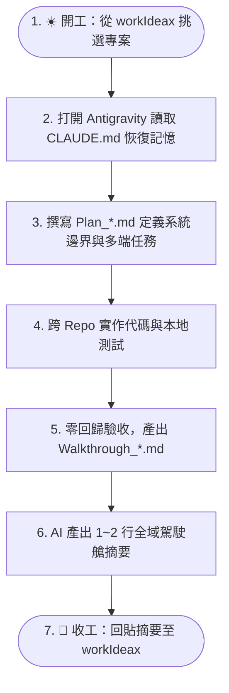

# 📖 專案知識庫使用指南 (How to Use This Template)

> 本文件詳細說明 **`obs-temp` 專案知識管理樣版 (v2.1.0)** 的設計哲學、目錄規範、Hub-and-Spoke 雙層架構、Antigravity 多工作區協作，以及如何高效推進全新開發或舊專案擴充。
> 
> 📝 **版本異動紀錄**：[[版本異動說明|📝 版本異動說明 (v2.1.0)]] ｜ 📜 **架構歷程**：[[專案知識庫開發歷程|📜 專案知識庫開發歷程與架構演進]]

---

## 🧭 目錄導覽

1. [核心設計哲學（雙庫解耦 ＋ Hub-and-Spoke 雙層架構）](#1-核心設計哲學)
2. [如何快速啟動一個新專案（支援全新與舊系統擴充）](#2-如何快速啟動一個新專案)
3. [目錄結構與職責分工](#3-目錄結構與職責分工)
4. [Antigravity 多工作區協作實戰手冊](#4-antigravity-多工作區協作實戰手冊)
5. [標準開發生命週期工作流（從規劃到結案 SOP）](#5-標準開發生命週期工作流從規劃到結案-sop)
6. [AI 助手（Claude / Antigravity / Gemini / Cursor）協作最佳實踐](#6-ai-助手協作最佳實踐)
7. [檔案命名與雙向連結規範](#7-檔案命名與雙向連結規範)
8. [Git 版本控制與安全守則](#8-git-版本控制與安全守則)
9. [架構演進與專案實務反哺機制 (Upstream Feedback Loop)](#9-架構演進與專案實務反哺機制)
   - 📜 模板詳細歷史：[[專案知識庫開發歷程|專案知識庫開發歷程與架構演進]]
   - 📝 最新版本異動：[[版本異動說明|版本異動說明 (v2.1.0)]]

---

## 1. 核心設計哲學

本樣版基於大型專案（Odoo 跨 5 大版本遷移、ezvas 電子工單多倉庫系統、高併發生產系統）實戰經驗提煉而成，核心架構圍繞四大支柱：

```
┌─────────────────────────────────────────────────────────────────────────┐
│ 1. 雙庫解耦：知識庫 (Docs Vault) ⟷ 程式碼倉庫 (Multi-Repo Git) 物理隔離       │
│ 2. 樞紐拓撲：總管理駕駛艙 (Hub: workIdeax) ⟷ 專案深度大腦 (Spoke: obs-[proj])   │
│ 3. 長短分流：日常主控看板 (Active) ⟷ 長期記憶庫 (Context: 規劃/研究/驗收/維運)  │
│ 4. 閉環演進：計畫 (Plan) ➔ 調研 (Research) ➔ 決策 (ADR) ➔ 驗收 (Walkthrough)   │
└─────────────────────────────────────────────────────────────────────────┘
```

### 🌟 Hub-and-Spoke 雙層架構運作模式
- **總管理駕駛艙（Hub 雙軌分流）**：
  - 🏢 **公司/客戶專案**：對齊 **`workIdeax`**（負責公司專案優先級、工時排程與宏觀里程碑）。
  - 🛸 **個人/學習專案**：對齊 **`obs-and`**（負責個人生涯目標、技術養成、靈修與個人計畫）。
- **專案深度大腦（Spoke: `obs-[專案]`）**：
  - 負責「深鑽視角 (Micro View)」：管理單一系統的實體架構、API 定義、多倉庫代碼修改、UAT 測試截圖與完整日誌。
  - **好處**：寫代碼時 100% 聚焦當前專案，公私物理隔離；在 Antigravity 同時掛載「Hub + Spoke + 代碼庫」時，收工指令能自動雙層寫入，免手動複製貼上！

---

## 2. 如何快速啟動一個新專案

### ⚡ 使用升級版 PowerShell 腳本：`init-new-project.ps1`

打開 PowerShell，進入本範本目錄：

#### 🟢 情境 A：全新專案（GreenField）
```powershell
cd D:\_obs\obs-temp
.\init-new-project.ps1 -ProjectKey "crm-v2" -ProjectName "新世代CRM系統"
```

#### 🔵 情境 B：舊系統新模組擴充 ＋ 多代碼倉庫（LegacyModule）
```powershell
cd D:\_obs\obs-temp
.\init-new-project.ps1 `
    -ProjectKey "ezvas" `
    -ProjectName "ezvas電子工單系統" `
    -Mode "LegacyModule" `
    -RepoPaths "D:\_giti3\ezvas-backend", "D:\_giti3\ezvas-frontend", "D:\_giti3\ezvas-admin"
```

> **腳本自動完成**：
> 1. 自動在 `D:\_obs\` 複製產生 `obs-ezvas`。
> 2. 自動將多個 Git 路徑格式化為 Markdown 表格並填入 `CLAUDE.md`、`README.md`、`專案索引.md`。
> 3. 自動依模式配置專屬的初始計畫與相容性調研文檔。

---

## 3. 目錄結構與職責分工

```text
D:\_obs\obs-[專案名稱]/
│
├── CLAUDE.md                              # 🤖 AI 助手全域記憶入口、多倉庫路徑與常用 Prompt
├── README.md                               # 🏠 專案首頁儀表板（Mermaid 全域跳轉圖與 Repo 清單）
├── 專案使用指南.md                         # 📖 本指南文件
│
├── _docs/                                  # ⚡ 日常動態維護看板（高頻讀寫）
│   ├── 待辦.md                             # 📋 當前進行中、待排程與已完成的任務清單
│   ├── 工作日誌.md                         # 📝 每日開發/測試/除錯紀錄（最新在最上方）
│   └── 專案索引.md                         # 🗺️ 多倉庫對照、模組與文件導覽地圖
│
├── _docs/_templates/                       # 📄 標準文件空白模板庫
│   ├── tpl_Plan.md                         # 實施計畫模板（含整合邊界、防腐層、多端任務）
│   ├── tpl_Walkthrough.md                  # 工作總結驗收模板（含多端變更清單、零回歸驗證）
│   ├── tpl_ADR.md                          # 架構決策紀錄條目模板
│   └── tpl_Research.md                     # 技術調研分析模板（含舊系統相容性探勘）
│
└── _docs/context/                          # 🏛️ 長期記憶庫（Master MOC）
    ├── 00_長期記憶導覽索引.md               # 雙向連結地圖（所有歷史文件之樞紐）
    ├── 01_規劃與計畫/                      # Plan_*.md、決策紀錄.md (ADR)
    ├── 02_技術研究與分析/                  # Research_*.md、架構比對、技術選型
    ├── 03_工作紀錄與驗證/                  # Walkthrough_*.md、UAT 測試報告、零回歸體檢
    └── 04_維運與部署/                      # 部署 SOP、工作流規範、上線 Checklist
```

---

## 4. Antigravity 多工作區協作實戰手冊

在 Antigravity 中建立專案時，推薦將**「知識庫」與「所有關聯 Git 倉庫」同時加入同一個 Workspace**：

```text
Antigravity 單一工作區視窗：
  ├── D:\_obs\obs-ezvas         (知識中樞：Plan / ADR / 日誌 / MOC)
  ├── D:\_giti3\ezvas-backend   (後端代碼庫)
  ├── D:\_giti3\ezvas-frontend  (前端代碼庫)
  └── D:\_giti3\ezvas-admin     (管理後台代碼庫)
```

- **為什麼這樣做最強大？**
  - **全端上帝視角**：AI 在對話中一邊讀取 `obs-ezvas` 的實施計畫，一邊直接跨資料夾修改後端 API 與前端 UI，無需在視窗間手動複製代碼。
  - **代碼跳轉與符號索引**：Antigravity 能自動索引多倉庫的函式與類別，實現跨端精準除錯。

---

## 5. 標準開發生命週期工作流（從規劃到結案 SOP）



1. **☀️ 開工（30秒）**：在 `workIdeax` 查看全域進度，決定今日主攻專案 ➔ 切換至 Antigravity 專案視窗。
2. **🧠 恢復記憶**：發送指令：`請讀取 CLAUDE.md、_docs/待辦.md 與 _docs/工作日誌.md 恢復記憶。`
3. **📋 規劃新功能**：複製 `_docs/_templates/tpl_Plan.md` 產出計畫，若有重大決策則更新 `決策紀錄.md`。
4. **🛠️ 跨端實作**：在 Antigravity 中直接修改後端與前端代碼。
5. **🧪 測試驗收**：複製 `_docs/_templates/tpl_Walkthrough.md` 記錄跨 Repo 修改清單與零回歸測試結果。
6. **🌙 收工歸檔**：發送標準收工指令，AI 自動更新日誌並產出 1~2 行摘要，複製貼回 `workIdeax`！

---

## 6. AI 助手協作最佳實踐

### 💡 核心指令庫 (Prompt Cheatsheet)

| 場景 | 推薦 Prompt 指令 |
| :--- | :--- |
| **開始工作** | `請依序讀取 CLAUDE.md、_docs/待辦.md 與 _docs/工作日誌.md，確認理解專案狀態後向我回報。` |
| **結束工作 (雙層產出)** | `請根據今日產出：1. 更新 CLAUDE.md 進度 2. 追加 _docs/工作日誌.md 3. 更新 _docs/待辦.md 4. 在對話最後輸出 1~2 行全域日誌摘要供回貼 workIdeax。` |
| **多 Repo 跨端代碼實作** | `請參考 Plan_【功能名稱】.md，直接跨目錄修改後端 API 與前端 UI 代碼，並在完成後進行驗收。` |
| **多 Repo Git-Diff 還原** | `請讀取各關聯倉庫的 git log -n 5 與關鍵 diff，還原代碼級記憶後向我匯報。` |

---

## 7. 檔案命名與雙向連結規範

1. **前綴規則**：
   - 計畫文件：**`Plan_`** 開頭（例如 `Plan_工單審批模組.md`）
   - 技術調研：**`Research_`** 開頭（例如 `Research_舊系統相容性探勘.md`）
   - 驗收總結：**`Walkthrough_`** 開頭（例如 `Walkthrough_工單審批驗收.md`）
2. **雙向連結維護**：
   - 任何新建於 `context/` 的檔案，都要同步加入 [`00_長期記憶導覽索引.md`](file:///D:/_obs/obs-temp/_docs/context/00_%E9%95%B7%E6%9C%9F%E8%A8%98%E6%86%B6%E5%B0%8E%E8%A6%BD%E7%B4%A2%E5%BC%95.md)。

---

## 8. Git 版本控制與安全守則

1. **Git Commit 邊界**：
   - 知識庫庫本身為獨立的 Git Repo，負責版本控管所有文檔與架構圖。
   - 所有代碼倉庫的 Commit 與 Push 必須由專案負責人審查後手動執行。
2. **安全防護（已內建於 `.gitignore`）**：
   - 自動忽略 Obsidian 的分頁暫存檔（`.obsidian/workspace.json`），防止多裝置同步衝突。
   - 自動忽略 `.env`、`*.key`、`*.pem`、`credentials.json`，防止機密洩漏。

---

## 9. 架構演進與專案實務反哺機制 (Upstream Feedback Loop)

在真實專案開發中，實務往往走在模板前面。當您使用本模板派生出具體專案（如 `obs-[專案]`）後，若在實際開發過程中產出了優異的架構、新模板或避坑流程，可透過**「兩階段解耦反哺模式」**逆向回饋給母模板 `obs-temp`，實現持續演進的活體架構 (Living Architecture)。

詳細歷程與決策脈絡請參閱：[[專案知識庫開發歷程|📜 專案知識庫開發歷程與架構演進]]。

### 🛡️ 核心原則：無雜訊原則 (Zero-Noise Principle)
- ❌ **日常不打擾**：AI 在日常高頻開發、修 Bug、收工總結時**絕對不進行自動提醒**，避免警報疲勞。
- ✅ **關鍵時機主動發起**：僅在專案完成「重大功能里程碑 (Milestone Walkthrough)」、「架構重構」或「專案結案」時，由開發者評估觸發。

### 📋 三維度反哺價值評估檢核
1. **跨專案通用性**：是否其他 2 個以上專案能直接受益（非客戶特定業務邏輯）？
2. **實戰驗收成熟度**：是否已在當前專案中被實機運行與測試通過？
3. **解耦與參數化成本**：能否在 5~10 分鐘內將特定變數抽換為 `{{PROJECT_KEY}}` 等通用佔位符？

### 🚀 兩階段操作 SOP 與標準 Prompt

#### 【階段 1：在派生專案中總結建議書】
在派生專案的 `_docs/context/01_規劃與計畫/` 中，套用選配模板 `tpl_obs_temp_enhancement_proposal`，產出一份建議書。
> **🤖 派生專案提議 Prompt**：
> ```text
> 請參考選配模板 tpl_obs_temp_enhancement_proposal，
> 針對我們本次在專案中實踐成功的 [XXX架構/模組]，
> 總結一份《Plan_obs-temp架構增強反饋規格建議書.md》，
> 重點闡述痛點背景、解決方案、去業務化建議與建議收錄分類。
> ```

#### 【階段 2：在母版 obs-temp 中吸收與實施】
開啟 `obs-temp` 工作區，指令 AI 跨庫讀取建議書並擬定實施計畫。
> **🤖 母版吸收 Review Prompt**：
> ```text
> 請跨庫讀取反饋建議書：
> [file:///D:/_obs/obs-{{PROJECT_KEY}}/_docs/context/01_規劃與計畫/Plan_obs-temp架構增強反饋規格建議書.md]
> 
> 請協助我：
> 1. 評估各項模組應歸類為「核心標配」或「進階選配」。
> 2. 為母模板 obs-temp 擬定【架構增強實施計畫】，完成去業務化與參數化設計。
> 3. 確認後實施修改，並在《專案知識庫開發歷程.md》追加本專案的演進日誌！
> ```

