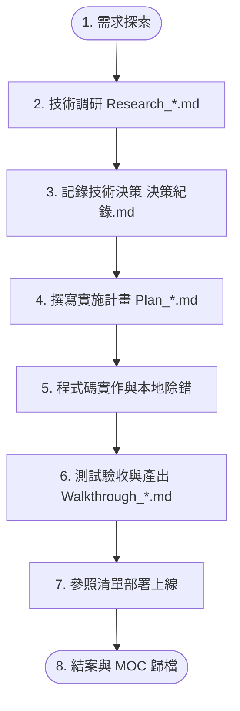

# 📖 專案知識庫使用指南 (How to Use This Template)

> 本文件詳細說明 **`obs-temp` 專案知識管理樣版** 的設計哲學、目錄規範、日常工作流，以及如何搭配 AI 助手與 Git 進行高效專案開發。

---

## 🧭 目錄導覽

1. [核心設計哲學](#1-核心設計哲學)
2. [如何快速啟動一個新專案（3 種方式）](#2-如何快速啟動一個新專案3-種方式)
3. [目錄結構與職責分工](#3-目錄結構與職責分工)
4. [標準開發生命週期工作流（從規劃到結案）](#4-標準開發生命週期工作流從規劃到結案)
5. [AI 助手（Claude / Gemini / Cursor）協作最佳實踐](#5-ai-助手claude--gemini--cursor協作最佳實踐)
6. [檔案命名與雙向連結規範](#6-檔案命名與雙向連結規範)
7. [Git 版本控制與安全守則](#7-git-版本控制與安全守則)

---

## 1. 核心設計哲學

本樣版基於大型專案（Odoo 跨 5 大版本遷移、高併發生產系統）實戰經驗提煉而成，核心架構圍繞三大支柱：

```
┌─────────────────────────────────────────────────────────────┐
│ 1. 雙庫解耦：知識庫 (Docs Vault) ⟷ 程式碼倉庫 (Git Repo) 物理隔離 │
│ 2. 動態分流：日常主控看板 (Active) ⟷ 長期記憶庫 (Context) 雙層解耦  │
│ 3. 閉環演進：計畫 (Plan) ➔ 研究 (Research) ➔ 驗證 (Walkthrough)   │
└─────────────────────────────────────────────────────────────┘
```

- **為什麼知識庫與代碼庫分離？**
  - 避免截圖、設計稿、大篇幅分析雜訊污染 Git 代碼庫的提交歷史。
  - 讓 AI 在閱讀知識庫時不被數萬行套件程式碼（`node_modules` / `vendor`）干擾。
  - 敏感資料（伺服器金鑰、內部架構草稿）與開源或團隊程式碼分離。
- **為什麼需要 Context 長期記憶分流？**
  - 專案推進幾個月後，會有數十篇計畫與測試紀錄。若全部堆在根目錄，日常的「待辦」與「日誌」會被雜訊淹沒。
  - 將歷史文件收納進 `01_規劃`、`02_研究`、`03_驗證`、`04_維運`，維持每日主控台極致乾淨。

---

## 2. 如何快速啟動一個新專案（3 種方式）

### ⚡ 方式 A：使用內建 PowerShell 腳本（最推薦、最快）

打開 PowerShell，進入本範本目錄，執行 [`init-new-project.ps1`](file:///D:/_obs/obs-temp/init-new-project.ps1)：

```powershell
cd D:\_obs\obs-temp
.\init-new-project.ps1 -ProjectKey "smart-prod" -ProjectName "智慧生產後端系統" -RepoPath "D:\_giti3\smart-prod"
```

> **自動完成**：
> 1. 自動在 `D:\_obs\` 複製產生 `obs-smart-prod` 資料夾。
> 2. 自動替換所有 Markdown 文件內的 `{{PROJECT_NAME}}`、`{{PROJECT_KEY}}`、`{{CURRENT_DATE}}`、`{{REPO_PATH}}`。
> 3. 清除範本自身腳本與 `.git`，生成全新可直接使用的 Vault。

---

### 🌐 方式 B：透過 GitHub Template 功能建立

若您已將此範本設為 GitHub 的 **Template repository**：
1. 進入 GitHub 上的 `obs-temp` 倉庫，點擊綠色的 **「Use this template」➔「Create a new repository」**。
2. 倉庫名稱命名為 `obs-<專案代號>`（如 `obs-line-app`）。
3. Clone 回本地：`git clone https://github.com/<帳號>/obs-line-app.git D:\_obs\obs-line-app`。
4. 全域搜尋替換 `{{PROJECT_NAME}}` 與 `{{PROJECT_KEY}}` 即可。

---

### 🖐️ 方式 C：手動複製

1. 複製 `D:\_obs\obs-temp` 資料夾並更名為 `D:\_obs\obs-<專案名>`。
2. 刪除其中的 `.git` 資料夾與 `init-new-project.ps1`。
3. 手動修改 `CLAUDE.md` 與 `README.md` 的專案基本資訊。

---

## 3. 目錄結構與職責分工

```text
D:\_obs\obs-[專案名稱]/
│
├── CLAUDE.md                              # 🤖 AI 助手全域記憶入口與常用 Prompt 指令
├── README.md                               # 🏠 專案首頁儀表板（Mermaid 全域架構跳轉圖）
├── 專案使用指南.md                         # 📖 本使用指南文件
│
├── _docs/                                  # ⚡ 日常動態維護看板（高頻讀寫）
│   ├── 待辦.md                             # 📋 當前進行中、待排程與已完成的任務清單
│   ├── 工作日誌.md                         # 📝 每日開發/測試/除錯紀錄（最新在最上方）
│   └── 專案索引.md                         # 🗺️ 模組、核心檔案與業務邏輯導覽地圖
│
├── _docs/_templates/                       # 📄 標準文件空白模板庫
│   ├── tpl_Plan.md                         # 實施計畫模板（目標/架構/階段/風險）
│   ├── tpl_Walkthrough.md                  # 工作總結驗收模板（變更清單/測試/截圖）
│   ├── tpl_ADR.md                          # 架構決策紀錄條目模板
│   └── tpl_Research.md                     # 技術調研分析模板（多維度比對/POC代碼）
│
└── _docs/context/                          # 🏛️ 長期記憶庫（Master MOC）
    ├── 00_長期記憶導覽索引.md               # 雙向連結地圖（所有歷史文件之樞紐）
    ├── 01_規劃與計畫/                      # Plan_*.md、決策紀錄.md (ADR)
    ├── 02_技術研究與分析/                  # Research_*.md、架構比對、技術選型
    ├── 03_工作紀錄與驗證/                  # Walkthrough_*.md、UAT 測試報告、體檢紀錄
    └── 04_維運與部署/                      # 部署 SOP、上線 Checklist、工作流規範
```

---

## 4. 標準開發生命週期工作流（從規劃到結案）

一個功能或階段開發的標準 SOP 如下：



### 步驟 1：開工前（恢復記憶）
打開 Obsidian 與 AI 助手對話視窗，向 AI 發送指令：
> *「請讀取 `CLAUDE.md`、`_docs/待辦.md` 與 `_docs/工作日誌.md`，了解目前專案進度，我們準備開始今日工作。」*

### 步驟 2：規劃新功能（撰寫計畫）
1. 複製 `_docs/_templates/tpl_Plan.md` 到 `_docs/context/01_規劃與計畫/Plan_【功能名】.md`。
2. 定義核心目標、資料庫變更、API 介面與任務拆解。
3. 若有重大技術選型，於 `_docs/context/01_規劃與計畫/決策紀錄.md` 追加一筆 ADR 紀錄。

### 步驟 3：撰寫程式碼（在代碼倉庫中）
切換至程式碼倉庫（例如 `D:\_giti3\<專案>`），進行開發與單元測試。

### 步驟 4：測試驗收（產出 Walkthrough）
1. 複製 `_docs/_templates/tpl_Walkthrough.md` 到 `_docs/context/03_工作紀錄與驗證/Walkthrough_【功能名】.md`。
2. 記錄變更檔案、測試步驟、截圖與驗收結論（🟢 通過）。
3. 將新建立的 `Plan` 與 `Walkthrough` 登記至 [`_docs/context/00_長期記憶導覽索引.md`](file:///D:/_obs/obs-temp/_docs/context/00_%E9%95%B7%E6%9C%9F%E8%A8%98%E6%86%B6%E5%B0%8E%E8%A6%BD%E7%B4%A2%E5%BC%95.md)。

### 步驟 5：每日收工（自動總結與歸檔）
向 AI 發送標準收工指令：
> *「請根據今天的對話與產出：1. 更新 CLAUDE.md 的目前進度 2. 將今日詳細工作附加到 `_docs/工作日誌.md` 最上方 3. 更新 `_docs/待辦.md` 勾選已完成項目。」*

---

## 5. AI 助手（Claude / Gemini / Cursor）協作最佳實踐

### 💡 核心指令庫 (Prompt Cheatsheet)

| 場景 | 推薦 Prompt 指令 |
| :--- | :--- |
| **開始工作** | `請依序讀取 CLAUDE.md、_docs/待辦.md 與 _docs/工作日誌.md，確認理解專案狀態後向我回報。` |
| **結束工作** | `請根據今日產出，更新 CLAUDE.md 進度、追加 _docs/工作日誌.md、更新 _docs/待辦.md。` |
| **精準代碼記憶還原** | `請讀取代碼倉庫 [路徑] 的 git log -n 5 與關鍵 diff，還原最新代碼細節後再開始討論。` |
| **撰寫實施計畫** | `請參考 _docs/_templates/tpl_Plan.md 格式，為 [新功能] 產出一份結構完整的實施計畫。` |
| **撰寫驗收總結** | `請參考 _docs/_templates/tpl_Walkthrough.md 格式，整理本次開發的修改清單與驗證結果。` |
| **架構決策評估** | `請針對 [技術 A] 與 [技術 B] 進行優缺點與成本分析，並依 tpl_ADR 格式產出決策建議。` |

---

## 6. 檔案命名與雙向連結規範

為了讓 Obsidian 的 Graph View（關聯圖譜）與 AI 檢索維持極高精準度，請嚴格遵守以下命名規範：

1. **前綴規則**：
   - 計畫文件：必須以 **`Plan_`** 開頭（例如 `Plan_JWT認證實作.md`）
   - 技術調研：必須以 **`Research_`** 開頭（例如 `Research_MQ訊息佇列評估.md`）
   - 驗收總結：必須以 **`Walkthrough_`** 開頭（例如 `Walkthrough_用戶註冊流程驗收.md`）
2. **雙向連結維護**：
   - 任何新建於 `context/` 的檔案，都要同步加入 [`00_長期記憶導覽索引.md`](file:///D:/_obs/obs-temp/_docs/context/00_%E9%95%B7%E6%9C%9F%E8%A8%98%E6%86%B6%E5%B0%8E%E8%A6%BD%E7%B4%A2%E5%BC%95.md) 的表格中。
   - 引用其他檔案時使用 Obsidian 標準語法：`[[Plan_某計畫名稱]]` 或 `[[_docs/context/01_規劃與計畫/決策紀錄|決策紀錄]]`。

---

## 7. Git 版本控制與安全守則

1. **Git Commit 邊界**：
   - 知識庫庫本身為獨立的 Git Repo，專門版本控管所有的 `.md` 與架構圖。
   - 建議每日收工或完成重要 Milestone 時，執行一次 Commit：
     ```bash
     git add .
     git commit -m "docs: 完成 Phase 1 架構設計與 UAT 驗證紀錄"
     git push
     ```
2. **安全防護（已內建於 `.gitignore`）**：
   - 自動忽略 Obsidian 的分頁暫存檔（`.obsidian/workspace.json`），防止多裝置同步衝突。
   - 自動忽略 `.env`、`*.key`、`*.pem`、`credentials.json`，防止敏感金鑰洩漏至 GitHub。
