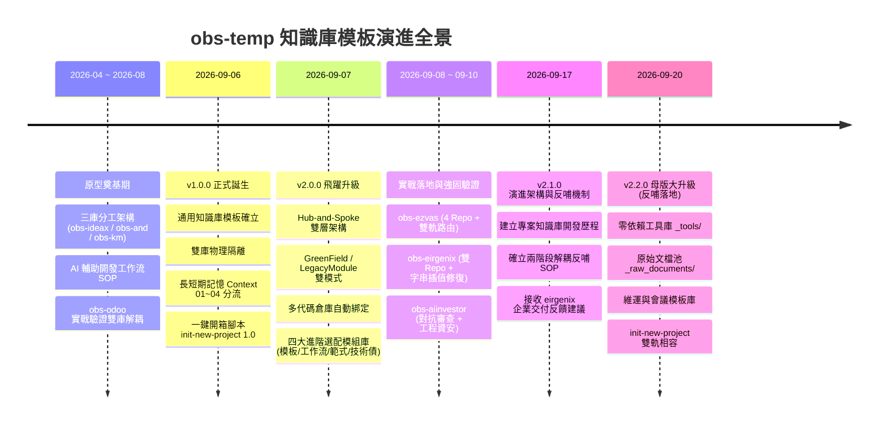
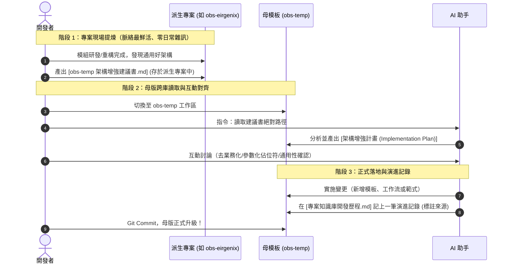

# 📜 專案知識庫開發歷程與架構演進 (Architecture Evolution & History)

> **核心使命**：記錄 `obs-temp` 知識管理模板的設計哲學、架構演進脈絡、重大架構決策 (ADR)，並定義「派生專案實務反哺母模板（Upstream Feedback Loop）」的標準工程機制。
> 
> 💡 **相關核心文件**：
> - [[版本異動說明|📝 版本異動說明 (v2.2.0)]]
> - [[專案使用指南|📖 專案知識庫使用指南 (How to Use)]]
> - [[_docs/選配體系使用指南|🧩 進階選配體系使用指南 (4大模組)]]
> - [[_docs/context/00_長期記憶導覽索引|🏛️ 長期記憶 Master MOC]]

---

## 🧭 一、架構核心理念與願景 (Philosophy & Architecture)

在 AI 輔助開發時代，程式碼與技術文檔如果混雜在同一 Git 倉庫，往往會面臨：**Git 提交雜訊多**、**AI 上下文被歷史文件淹沒**、**多倉庫專案無法統籌協調** 等三大痛點。

`obs-temp` 的誕生是為了建立一套具備「活體架構 (Living Architecture)」特性的專案大腦，秉持四大核心底層原則：

1. **雙庫解耦 (Repository Separation)**：
   - 知識大腦 (`obs-[project]`) 與實體代碼庫 (`[repo]`) 物理隔離。
   - 代碼庫保持純淨提交；知識庫專注於架構、API、ADR、日誌與決策。
2. **長短期記憶動態分流 (Active vs. Context)**：
   - **日常動態看板**（`待辦.md`、`工作日誌.md`、`專案索引.md`）：維持輕量、高頻讀寫，讓 AI 一秒載入當前任務。
   - **長期記憶系統**（`_docs/context/` 四大板塊 + Master MOC）：結構化收納歷史計畫、技術調研與驗收報告，隨查隨用。
3. **Hub-and-Spoke 雙層駕駛艙 (Global Hub ⟷ Deep Spoke)**：
   - **總管理駕駛艙 (Hub)**：`workIdeax`（工作/客戶全域）與 `obs-and`（個人全域），負責宏觀優先級與高階摘要。
   - **專案深度大腦 (Spoke)**：各獨立專案知識庫（`obs-[proj]`），負責深入微觀代碼、API 定義、多倉庫協同與 ADR。
4. **活體架構與實務反哺 (Upstream Feedback Loop)**：
   - 模板並非僵化不變的教條。派生專案在實戰中淬煉出的優秀架構，可透過無雜訊的「兩階段反哺流程」逆向回流，持續強化母模板。

---

## 🗺️ 二、架構演進全景圖 (Milestones & Evolution)



---

## 📅 三、詳細演進日誌與實戰反饋 (Detailed Evolution Log)

### 2026-09-20 — v2.2.0 吸收 eirgenix 六大反饋模組落地與雙軌向下相容設計

- **反哺貢獻來源**：[`D:\_obs\obs-eirgenix`](file:///D:/_obs/obs-eirgenix)（台康生技費用報支與 T100 ERP 串接專案實戰反饋規格建議書）
- **背景**：
  在企業級交付與多端協作專案中，面臨大量客戶原始 Word/Excel 交付、缺乏輕量讀取工具、主機連線散落、多 Repo Commit 粒度不足等痛點。母版正式依據反哺 SOP 吸收並落地此六大模組。
- **重大升級**：
  1. **建立根目錄輕量級工具庫 (`_tools/`)**：
     - `read_docx.py`：純標準庫解析 Word 段落文字，支援 CLI 參數與 Markdown 輸出。
     - `read_xlsx.py`：純標準庫解析 Excel，具備 `--list-sheets` 工作表秒級探測與 Markdown 表格轉換。
     - `probe_health.py`：HTTP/HTTPS 服務健康檢查與回應延遲探針。
     - `deploy_template.py.sample`：提供備份、上傳、語法檢查與容器重啟之部署標準範本。
  2. **建立通用原始規格文檔池 (`_docs/_raw_documents/`)**：
     - 確立「原始輸入 ➔ 工具萃取 ➔ 結構化 Markdown」三段式流轉生命週期。
     - 領域中立命名，為未來無縫延伸至「商業管理/論文研究」奠定通用架構基礎。
  3. **補齊維運與溝通模板庫 (`_docs/_templates/`)**：
     - `tpl_Server_Environment.md`：伺服器環境拓撲與連線管理模板（附帶強資安警告 Callout）。
     - `tpl_Docker_Architecture.md`：主機容器運行拓撲、Port 與磁碟映射、SPA 與 API 轉發機制解析。
     - `optional/tpl_Meeting_Briefing.md`：跨團隊/顧問會議溝通發言要點與議題選項模板。
  4. **開箱腳本雙軌向下相容 (`init-new-project.ps1`)**：
     - 保留 `-RepoPaths` 陣列（完全向下相容既有操作習慣）。
     - 新增 `-RepoMap` 具名雜湊表（支援自訂「後端 API」、「前端 Web」等語意化角色）。
     - 自動複製 `_tools/` 與 `_raw_documents/`，確保新專案開箱即用。
  5. **資安邊界強化 (`.gitignore`)**：
     - 深度排除 VPN 憑證（`*.ovpn`, `*.p12`, `*.key`）、私人金鑰與大型壓縮檔。
  6. **AI 進度格式升級 (`CLAUDE.md`)**：
     - 固化「需求背景、前端 Commit、後端 Commit、編譯目標、實機驗收」高密度進度範式。

---

### 2026-09-17 — v2.1.0 建立專案知識庫開發歷程與確立「兩階段解耦反哺機制」

- **背景**：
  隨著 `obs-temp` 成功派生出多個不同型態的專案（如 `obs-ezvas`、`obs-eirgenix`、`obs-aiinvestor`），團隊發現「實務專案常能產出比母模板更進階的架構實踐」。若缺乏演進歷程與標準反哺機制，這些寶貴經驗將散落各處。
- **重大升級**：
  1. **建立《專案知識庫開發歷程.md》**：完整沉澱母模板架構起源、版本里程碑與實務落地反饋。
  2. **確立「兩階段解耦反哺機制」**：遵循「無雜訊原則（Zero-Noise）」，設計「派生專案現場提議 (RFC) ➔ 母模板跨庫 Review 吸收 ➔ 模板演進更新」之標準 SOP。
  3. **新增建議書標準模板**：提供 `_docs/_templates/optional/tpl_obs_temp_enhancement_proposal.md`，讓未來任何專案皆有一致的提議格式。
  4. **登錄重要反饋來源**：正式收錄來自 `obs-eirgenix` 之 [`Plan_obs-temp架構增強反饋規格建議書.md`](file:///D:/_obs/obs-eirgenix/_docs/context/01_規劃與計畫/Plan_obs-temp架構增強反饋規格建議書.md)（涵蓋零依賴 Office 解析工具庫 `_tools/`、原始規格資產池 `_raw_history/`、主機拓撲模板與具名多倉庫支援）。

---

### 2026-09-10 — v2.0.3 實戰驗證：obs-aiinvestor（全新專案 + gstack 對抗審查閉環）

- **專案模式**：`GreenField`（全新從 0 到 1 智慧投資系統）
- **實戰成果**：
  - 成功預裝四大進階選配庫，隨插即用。
  - 結合 `wf_gstack_review.md`（gstack `/office-hours`）進行 2 輪邊界對抗式審查，成功收斂 MVP。
  - 結合 `tpl_Eng_Review.md` 進行資安與工程風險體檢（狀態機、WAL 模式、環境變數隔離），達到 0 未解決項目。
- **反哺母版調整**：
  - 強固 PowerShell 5.1 在 Windows 環境執行 UTF-8 BOM 之相容性，確保所有 Markdown 模板替換與 emoji 字串無誤。

---

### 2026-09-09 — v2.0.2 實戰驗證：obs-eirgenix（雙倉庫協同與腳本修復）

- **專案模式**：`LegacyModule`（台康生技費用報支與 T100 ERP 串接）
- **實戰成果**：
  - 成功綁定後端（PHP Slim 4 API）與前端（Vue 2 + Element UI）雙實體代碼倉庫。
  - 跨端串聯 API 定義與前端狀態管理。
- **反哺母版調整**：
  - 修復 `init-new-project.ps1` 模板中多代碼倉庫 Markdown 關聯表格在 PowerShell 字串插值中反引號跳脫的問題，確保生成精確的本地跳轉連結。

---

### 2026-09-08 — v2.0.1 實戰驗證：obs-ezvas（舊系統 4 倉庫整合與雙軌路由）

- **專案模式**：`LegacyModule`（ezvas 電子工單系統擴充）
- **實戰成果**：
  - 成功綁定 4 個實體代碼庫（後端 API、前端系統、現場報工 UI、列印輔助工具）。
  - 建立 Antigravity 6 資料夾多工作區協同最佳實踐（1 Hub + 1 Spoke + 4 Repos）。
- **反哺母版調整**：
  - **總駕駛艙雙軌路由準則**：確立公司專案對齊 `workIdeax`，個人專案對齊 `obs-and`。
  - **雙層自動化歸檔機制**：結尾指令自動產出 1~2 行高階里程碑摘要回貼總駕駛艙。
  - 修復路徑反斜線正規化，避免 Markdown 連結轉義異常。

---

### 2026-09-07 — v2.0.0 知識庫樣版 2.0 全面升級（Hub-and-Spoke 與四大選配體系）

- **背景**：
  面對全新專案 (GreenField) 與舊系統新模組擴充 (LegacyModule)，以及單一專案跨前端/後端/後台多個倉庫的龐大架構。
- **重大升級**：
  1. **Hub-and-Spoke 雙層架構**：解決「單一大庫雜訊干擾 AI」與「多個散庫失去宏觀視角」的根本矛盾。
  2. **開箱腳本 2.0 (`init-new-project.ps1`)**：支援 `-Mode` 雙模式與 `-RepoPaths` 多代碼倉庫陣列自動排版。
  3. **四大進階選配模組庫建立**：
     - 📦 **工程功能模板 (`_templates/optional/`)**：資安與工程審查、冒煙測試、成果展示、排錯避坑卡片。
     - ⚡ **AI 開發工作流 (`workflows/`)**：gstack 審查、對抗式代碼審查、TDD 測試先行。
     - 🏗️ **頂級架構範式 (`patterns/`)**：非同步 MQ + 原子 Upsert 抗併發、絞殺者遷移範式。
     - ⏳ **治理與追蹤 (`_docs/`)**：技術債與延後決策追蹤器。
  4. **專案指南全面升級**：產出《選配體系使用指南.md》與升級版《專案使用指南.md》。

---

### 2026-09-06 — v1.0.0 通用專案知識管理樣版建立（雙庫解耦與 Context 長期記憶）

- **背景**：
  汲取 `obs-odoo` 實戰經驗，解決過去文件零散、未適配 AI、日常待辦被歷史淹沒的問題。
- **重大建立**：
  1. **雙庫解耦機制**：確立 `obs-[project]` 與代碼倉庫分離原則。
  2. **長短期記憶分流**：建立 `_docs/context/` 四大板塊（01規劃、02研究、03驗證、04維運）與 Master MOC。
  3. **標準模板庫**：建立 Plan、Walkthrough、ADR、Research 四大核心模板。
  4. **自動化開箱**：撰寫 `init-new-project.ps1` 1.0 與專案使用手冊。

---

## 💡 四、重大架構決策紀錄總覽 (Architectural Decision Records)

本模板的核心架構由以下五大經典 ADR 奠定：

| ADR 代號 | 決策主題 | 核心決策與解法 | 效益與價值 |
| :---: | :--- | :--- | :--- |
| **ADR-01** | **雙庫物理隔離** | 知識庫 (`obs-*`) 與代碼倉庫完全分離，各自獨立 Git 控管 | 徹底隔絕業務代碼與技術筆記，保持提交乾淨，消除 AI 上下文污染 |
| **ADR-02** | **長短期記憶分流** | 根目錄維護高頻看板，歷史文檔收納於 `_docs/context/` 01~04 板塊 | 避免看板隨時間推移被淹沒，AI 透過 Master MOC 一秒檢索歷史 |
| **ADR-03** | **Hub-and-Spoke 雙層連動** | 全域由 `workIdeax`/`obs-and` 統籌；專案微觀由 `obs-[proj]` 深度記錄 | 兼顧宏觀鳥瞰排程與微觀代碼實作，消弭跨專案雜訊 |
| **ADR-04** | **四大進階選配體系** | 核心保持輕量（標配），進階工程能力（工作流/架構範式/審查）以模組化積木選配 | 專案開箱無包袱，複雜專案隨插即用 |
| **ADR-05** | **Antigravity 多工作區協同** | 工作區同時掛載知識庫與關聯代碼庫，AI「左手看 Plan，右手改代碼」 | 突破單一倉庫視角，實現全端、跨目錄自動化實作與驗收 |

---

## 🔄 五、專案實務反哺機制規範 (Upstream Feedback Loop SOP)

在真實專案開發中，實務往往走在模板前面。為了讓模板持續進化為「活體架構 (Living Architecture)」，同時**徹底杜絕日常開發時的對話雜訊與警報疲勞**，本體系確立以下反哺規範：

### 5.1 核心原則：無雜訊原則 (Zero-Noise Principle)
- ❌ **日常零干擾**：AI 在每次日常收工總結時，**絕不主動詢問**「是否有架構要反哺？」，保持日常開發輕快專注。
- ✅ **關鍵時機發起**：僅在專案完成重大功能里程碑驗收（Milestone Walkthrough）、架構重構或專案結案時，由開發者主動發起或評估。

### 5.2 三維度反哺價值評估檢核表 (Heuristic Checklist)
當考慮將某項專案產出反哺回母模板時，依據以下三維度進行檢核：

1. **跨專案通用性 (Cross-Project Reusability)**：
   - 是否為業務特例（如某客戶特定扣抵率）？ ➔ ❌ 不反哺。
   - 是否為其他 2 個以上專案皆能直接受惠的工程架構（如新的防腐層、新測試腳本、新審查工作流）？ ➔ ✅ 具備反哺價值。
2. **實戰驗收成熟度 (Battle-Tested)**：
   - 是否只是未經驗證的想法或實驗品？ ➔ ❌ 暫緩反哺。
   - 是否已在當前專案中被實機運行、測試通過並形成穩定文檔？ ➔ ✅ 具備反哺價值。
3. **解耦與參數化成本 (Decoupling & Templatization)**：
   - 能否在 5~10 分鐘內剝離特定領域變數，轉化為 `{{PROJECT_KEY}}` 佔位符或選配積木？ ➔ ✅ 具備反哺價值。

---

### 5.3 兩階段解耦反哺操作流程 (Two-Phase Decoupled Workflow)



#### 【階段 1：在派生專案中提煉建議書】
- **操作方式**：
  在派生專案（例如 `obs-eirgenix`）的 `_docs/context/01_規劃與計畫/` 中，以模板 `tpl_obs_temp_enhancement_proposal.md` 產出一份建議書（例如：`Plan_obs-temp架構增強反饋規格建議書.md`）。
- **觸發 Prompt 範例**：
  ```text
  請參考選配模板 tpl_obs_temp_enhancement_proposal，
  針對我們本次在專案中實踐成功的 [XXX架構/工具]，
  總結一份《Plan_obs-temp架構增強反饋規格建議書.md》，
  重點闡述痛點背景、解決方案、去業務化建議與建議收錄分類。
  ```

#### 【階段 2：在母模板 obs-temp 中吸收與實施】
- **操作方式**：
  開啟 `obs-temp` 工作區，指令 AI 跨庫讀取該建議書，評估通用性並產出實施計畫。
- **觸發 Prompt 範例**：
  ```text
  請跨庫讀取 [D:\_obs\obs-eirgenix\_docs\context\01_規劃與計畫\Plan_obs-temp架構增強反饋規格建議書.md]，
  為母模板 obs-temp 規劃架構增強實施計畫。
  請協助我評估各項模組應歸類為「核心標配」或「進階選配」，並將專案業務硬編碼轉為通用佔位符。
  確認後我們再正式實施。
  ```

#### 【階段 3：演進日誌沉澱與版本升級】
1. 將通過審查的模組納入 `_templates/`、`_templates/optional/`、`workflows/`、`patterns/` 或升級腳本。
2. 在本文檔（《專案知識庫開發歷程.md》）之「三、詳細演進日誌」追加一筆記錄，**明確標記靈感與貢獻來源專案**。
3. 視變更幅度微調版本號（Semantic Versioning），並完成 Git Commit。
4. 未來所有透過 `init-new-project.ps1` 建立的新專案，即刻開箱受惠！
